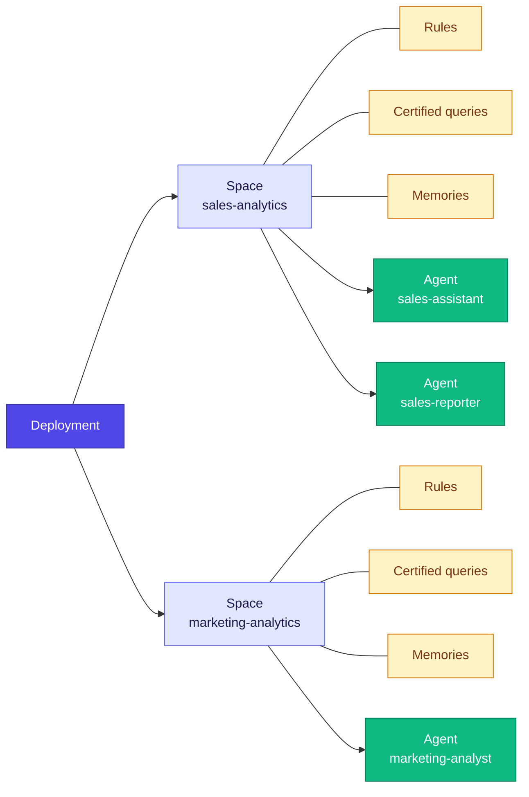

Every Cube deployment ships with a single agent by default — see the [Overview](/admin/ai) for the standard configuration. For more advanced setups, you can configure **multiple agents** within the same deployment, each with its own model, accessible views, rules, and certified queries.

Multi-agent is useful when:

- Different teams need agents tuned to their own domain (e.g., a Sales Assistant and a Marketing Analyst).
- You want specialized agents with distinct instructions or tool access in the same deployment.
- You need to isolate context (rules, certified queries, memories) between user groups.

<Warning>
  Spaces and agents must first be created through the Cube Cloud UI before they can be configured via YAML. The system matches YAML entries to UI-created spaces and agents by their `name` field.
</Warning>

## Architecture

A multi-agent setup introduces one new concept on top of the single-agent model: **spaces**.

- A **deployment** can contain one or more **spaces**.
- A **space** is an isolated context. It owns its **rules**, **certified queries**, and **memories** — they are not shared across spaces.
- Each **agent** belongs to exactly one space and inherits everything that space owns. Multiple agents can live in the same space and share the same rules, certified queries, and memories.

This means you choose a space's boundary based on what context should be shared. Two agents serving the same team usually live in one space; agents serving different domains (Sales vs. Marketing) live in different spaces so their context stays separate.



In the [single-agent setup](/admin/ai), there is an implicit `auto` space that holds all rules, certified queries, and memories — you don't need to think about it. In a multi-agent setup, you define spaces explicitly and attach rules and certified queries to specific spaces.

## What changes from the single-agent setup

The [`agents/` file structure](/admin/ai#agent-configuration) is the same. What's different is how `agents/config.yml` is shaped:

1. **Agents are defined as an array.** Each agent gets a unique `name` and an optional `description`, in addition to the standard agent [properties](/admin/ai#properties) (`llm`, `runtime`, `accessible_views`, `memory_mode`, etc.).
2. **Spaces are introduced.** A `spaces` array defines the contexts agents operate in. Each space gets a unique `name`.
3. **Rules and certified queries attach to spaces.** Use the `space` property in the frontmatter of each rule or certified query Markdown file to attach it to a specific space.

<Warning>
  You cannot mix flat root-level properties (the single-agent style) with `spaces` or `agents` arrays in the same file. Use one style per file.
</Warning>

## Agents

Replace the flat root-level agent properties with an `agents` array:

```yaml
# agents/config.yml
agents:
  - name: sales-assistant                   # Required
    description: "AI assistant for sales analytics"
    space: sales-analytics                  # Required: reference to a space
    llm: claude_4_6_sonnet
    accessible_views:
      - orders_view
      - customers_view
    memory_mode: user

  - name: marketing-analyst                 # Required
    description: "AI assistant for marketing analytics"
    space: marketing-analytics              # Required
    llm: gpt_5
```

The properties available on each agent are the same as in the [single-agent setup](/admin/ai#properties), plus:

| Property      | Type   | Required | Description                                                |
|---------------|--------|:--------:|------------------------------------------------------------|
| `name`        | string | Yes      | Unique identifier for the agent.                           |
| `description` | string | No       | Human-readable description.                                |
| `space`       | string | Yes      | Name of the [space](#spaces) this agent belongs to.        |

## Spaces

A space is the context an agent operates in. Spaces own the rules, certified queries, and memories that the agents inside them share. Define spaces alongside agents:

```yaml
# agents/config.yml
spaces:
  - name: sales-analytics                   # Required
    description: "Space for sales team analytics and reporting"

  - name: marketing-analytics               # Required
    description: "Space for marketing team analytics"
```

| Property      | Type   | Required | Description                                |
|---------------|--------|:--------:|--------------------------------------------|
| `name`        | string | Yes      | Unique identifier for the space.           |
| `description` | string | No       | Human-readable description.                |

Each agent must reference exactly one space via its `space` property. Multiple agents can share the same space and inherit its rules, certified queries, and memories.

## Attaching rules and certified queries to a space

In the single-agent setup, [rules](/admin/ai/rules) and [certified queries](/admin/ai/certified-queries) belong to the implicit `auto` space. In a multi-agent setup, you must attach each rule and certified query to a specific space using the `space` property in the Markdown frontmatter:

```markdown
<!-- agents/rules/fiscal-year.md -->
---
space: sales-analytics
type: always
---
Always use fiscal year starting April 1st when analyzing dates.
```

```markdown
<!-- agents/certified_queries/quarterly-revenue.md -->
---
space: sales-analytics
description: "Apply when the user asks about quarterly revenue"
user_request: "What is the revenue by quarter?"
---
SELECT
  DATE_TRUNC('quarter', order_date) AS quarter,
  SUM(amount) AS revenue
FROM orders
WHERE status != 'cancelled'
GROUP BY 1
ORDER BY 1
```

You can also organize rules and certified queries into space-named subdirectories. Files placed under `agents/rules/<space-name>/` or `agents/certified_queries/<space-name>/` are attached to that space automatically — no `space` frontmatter required.

## Complete example

```yaml
# agents/config.yml
spaces:
  - name: sales-analytics
    description: "Space for sales team analytics and reporting"

  - name: marketing-analytics
    description: "Space for marketing team analytics"

agents:
  - name: sales-assistant
    description: "AI assistant for sales analytics and reporting"
    space: sales-analytics
    llm: claude_4_6_sonnet
    accessible_views:
      - orders_view
      - customers_view
      - products_view
    memory_mode: user

  - name: marketing-analyst
    description: "AI assistant for marketing analytics"
    space: marketing-analytics
    llm: gpt_5
    memory_mode: user
```
