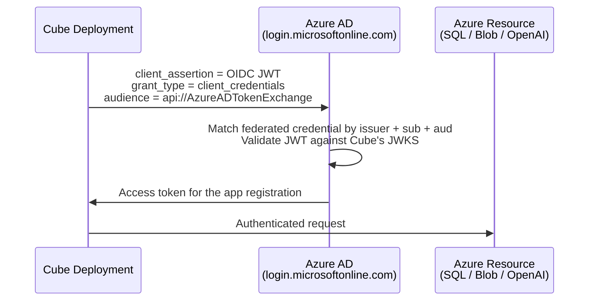

This guide walks through configuring Azure to trust Cube's OIDC issuer using
**federated credentials** on an Azure AD app registration, and shows the
setup for the most common targets — Azure SQL and an Azure Blob Storage
export bucket.

If you haven't enabled OIDC for your tenant yet, start with the
[OIDC overview][ref-oidc-overview].

<Info>

Available on the [Enterprise plan](https://cube.dev/pricing).

</Info>

## Prerequisites

- The Cube tenant has OIDC enabled and an `Azure` token config exists under
  **Admin → OIDC**.
- Permissions in your Azure AD tenant sufficient to create an app
  registration and add federated credentials, plus an Azure subscription
  where you can grant the app role assignments on resources.
- Your Cube tenant slug — the leftmost label of your tenant's console URL.
  Throughout this guide it's referenced as `<tenant-name>` (and the full
  issuer URL as `https://<tenant-name>.cubecloud.dev`). Substitute your
  actual slug everywhere it appears.

<Warning>

Commands and federated-credential snippets in this guide use angle-bracket
placeholders — `<tenant-name>`, `<deployment-id>`, etc.
**Replace each placeholder with your real value** before running. Azure
will accept these strings literally and the federation call will fail with
a confusing error.

</Warning>

## How Azure federation works

Azure doesn't have a generic OIDC provider registration the way AWS does.
Instead, you configure each app registration (or user-assigned managed
identity) with a **federated credential** that pins the issuer URL,
expected `aud`, and exact `sub` value. When Cube presents a JWT that
matches all three, Azure AD swaps it for an access token scoped to the
app registration.



<Warning>

Azure caps you at **20 federated credentials per app registration**. For
tenants with many deployments, see [Scaling past 20
credentials](#scaling-past-20-federated-credentials) below.

</Warning>

## Step 1: Create or pick an app registration

You can use an existing app registration or create a new one — Cube doesn't
have any opinion as long as it has the federated credential and the role
assignments.

```bash
az ad app create --display-name "Cube Cloud Deployment"
```

Note the **Application (client) ID** — this is your `AZURE_CLIENT_ID`. The
**Directory (tenant) ID** is your `AZURE_TENANT_ID`. Both are visible in
the Azure portal under **Microsoft Entra ID → App registrations → Cube
Cloud Deployment → Overview**.

## Step 2: Add a federated credential

The federated credential is what binds the app registration to a specific
Cube subject. Each credential matches **exactly one** issuer + subject +
audience triple — Azure doesn't support wildcards or pattern matching here.

```bash
az ad app federated-credential create \
  --id <APP_OBJECT_ID> \
  --parameters '{
    "name": "cube-<tenant-name>-deployment-<deployment-id>",
    "issuer": "https://<tenant-name>.cubecloud.dev",
    "subject": "cube:deployment:<deployment-id>:component:cube_api",
    "audiences": ["api://AzureADTokenExchange"]
  }'
```

| Field         | Value                                                                                         |
| ------------- | --------------------------------------------------------------------------------------------- |
| `issuer`      | Your Cube tenant's URL: `https://<tenant-name>.cubecloud.dev`.                                 |
| `subject`     | The exact `sub` claim Cube emits — typically `cube:deployment:<deployment-id>:component:<component>`. |
| `audiences`   | Always `["api://AzureADTokenExchange"]` — this is the standard Azure AD token-exchange audience. |
| `name`        | A human-readable label. Pick something that lets you find this credential later.              |

Each Cube component you want this app to authenticate as needs its own
federated credential. So if a deployment runs both Cube API and Cube Store
against the same Azure resource, you create two credentials — one with
`subject` ending in `:component:cube_api` and one ending in
`:component:cube_store`.

Cube's default `sub` claim is `cube:deployment:<deployment_id>`. To match
the `:component:<component>` examples in this guide (or to add
`:region:<region>`), open your Azure token config in **Admin → OIDC** and
paste one of these templates into the **Subject Claim Format** field:

- `cube:deployment:{deployment_id}:component:{component}` — for the
  `cube:deployment:<deployment-id>:component:<component>` examples below.
- `cube:deployment:{deployment_id}:component:{component}:region:{region}` —
  to additionally pin a [Cube Cloud region][ref-cube-cloud-region].

See [the subject editor section][ref-sub-editor] for the full syntax.

<Warning>

Azure pins the federated credential's `subject` field literally — changing
the format means recreating every federated credential that references it.
Create the new federated credential first, then change the **Subject Claim
Format** on the token config.

</Warning>

## Step 3: Set the deployment identity

Add two env vars to your deployment under **Settings → Environment
variables**:

```dotenv
AZURE_TENANT_ID=00000000-0000-0000-0000-000000000000
AZURE_CLIENT_ID=11111111-1111-1111-1111-111111111111
```

- **`AZURE_TENANT_ID`** — the Microsoft Entra ID (Azure AD) tenant where
  your app registration lives.
- **`AZURE_CLIENT_ID`** — the Application (client) ID of the app
  registration.

## Step 4: Assign roles on Azure resources

Grant the app registration the standard Azure RBAC roles it needs, the
same way you'd grant any service principal access to a resource. Examples
follow per target.

## Azure SQL

<Steps>
  <Step title="Create the federated credential">
    See [Step 2](#step-2-add-a-federated-credential) — pin subject to
    `cube:deployment:<deployment-id>:component:cube_api`.
  </Step>
  <Step title="Create a contained user in Azure SQL">
    Connect to your Azure SQL database as an Entra-authenticated admin and
    create a user backed by the app registration:

    ```sql
    CREATE USER [Cube Cloud Deployment] FROM EXTERNAL PROVIDER;
    ALTER ROLE db_datareader ADD MEMBER [Cube Cloud Deployment];
    GRANT EXECUTE ON SCHEMA::dbo TO [Cube Cloud Deployment];
    ```

    The user name must match the app registration's display name.
  </Step>
  <Step title="Configure the deployment">
    Set the MSSQL driver and identity env vars on the deployment:

    ```dotenv
    CUBEJS_DB_TYPE=mssql
    CUBEJS_DB_HOST=my-server.database.windows.net
    CUBEJS_DB_NAME=my-db
    CUBEJS_DB_PORT=1433
    AZURE_TENANT_ID=00000000-0000-0000-0000-000000000000
    AZURE_CLIENT_ID=11111111-1111-1111-1111-111111111111
    ```

    The MSSQL driver uses the `azure-active-directory-access-token` auth
    type with the federated token Cube provides. No username, password, or
    client secret needed.
  </Step>
</Steps>

## Azure Blob Storage export bucket

If your data source uses an [export bucket][ref-export-bucket] for
pre-aggregation unloads, grant the app registration **Storage Blob Data
Contributor** on the storage account.

<Steps>
  <Step title="Grant role assignment">
    Assign **Storage Blob Data Contributor** on the storage account scope:

    ```bash
    az role assignment create \
      --assignee <APP_CLIENT_ID> \
      --role "Storage Blob Data Contributor" \
      --scope "/subscriptions/<SUB_ID>/resourceGroups/<RG>/providers/Microsoft.Storage/storageAccounts/<ACCOUNT>"
    ```

    For tighter scoping, narrow to a specific container with
    `.../blobServices/default/containers/<container>` instead of the whole
    storage account.
  </Step>
  <Step title="Configure the export bucket env vars">
    Point the export bucket env vars at your container:

    ```dotenv
    CUBEJS_DB_EXPORT_BUCKET_TYPE=azure
    CUBEJS_DB_EXPORT_BUCKET=https://<account>.blob.core.windows.net/<container>
    AZURE_TENANT_ID=00000000-0000-0000-0000-000000000000
    AZURE_CLIENT_ID=11111111-1111-1111-1111-111111111111
    ```

    The Azure storage client picks up the same federated identity. See the
    [export bucket reference][ref-export-bucket] for the full set of
    variables.
  </Step>
</Steps>

## Scaling past 20 federated credentials

A single app registration accepts at most **20 federated credentials**.
Three patterns cover most growth scenarios:

- **One app registration per deployment.** Each deployment gets its own
  app + role assignments. Clean isolation, but you have to provision a new
  app every time you add a deployment.
- **Multiple app registrations behind one set of role assignments.** Group
  deployments by access pattern (e.g. read-only vs read-write); each group
  gets its own app, and the role assignments target the same resources.
- **User-assigned managed identities.** Each managed identity has its own
  20-credential limit, and you can attach many of them to your tenant.
  Useful when you want the resource permissions managed in Azure
  alongside other infrastructure rather than as RBAC on app registrations.

If you expect more than ~10 deployments in a single tenant, plan for one
of these patterns up front — splitting later is a recreation, not a
migration.

## Verifying the setup

The fastest way to confirm the federated credential is wired up correctly
is the **Test connection** button on the relevant settings page (data
source wizard, BYO LLM provider). Behind the scenes, Cube issues a real
OIDC token, exchanges it with Azure AD, and returns a precise error if
anything is misconfigured.

If the test fails:

| Symptom                                                                | Likely cause                                                                                                                                                                                                  |
| ---------------------------------------------------------------------- | ------------------------------------------------------------------------------------------------------------------------------------------------------------------------------------------------------------- |
| `AADSTS70021: No matching federated identity record found`             | The federated credential's `issuer`, `subject`, and `audiences` triple doesn't match the JWT exactly. Compare with the `iss` / `sub` / `aud` of a token from the **Test connection** error response.           |
| `AADSTS700213: No matching federated identity record found ... subject` | The subject claim differs by even a single character. Azure doesn't support wildcards — you need one credential per exact subject.                                                                            |
| `AADSTS50034: The user account does not exist`                          | You're using the wrong `AZURE_TENANT_ID`. Double-check the directory ID on the app registration's Overview blade.                                                                                              |
| `AADSTS500011: The resource principal ... was not found`               | The role assignment hasn't been created on the target resource, or it's still propagating. Wait a minute and retry; if it persists, re-check the `--assignee` and `--scope` values.                            |

Federation events show up in **Microsoft Entra ID → Sign-in logs** under
the **Service principal sign-ins** tab — filter by the app registration to
see which deployments are authenticating, when, and which resources they
hit.

[ref-oidc-overview]: /admin/deployment/oidc
[ref-sub-editor]: /admin/deployment/oidc#subject-claim-format
[ref-cube-cloud-region]: /admin/deployment/infrastructure#what-is-a-cube-cloud-region
[ref-export-bucket]: /admin/connect-to-data#export-bucket
