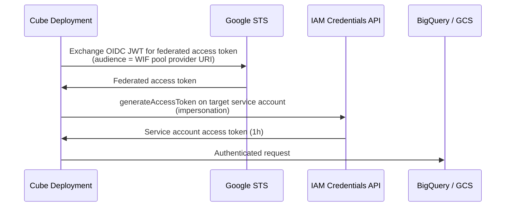

This guide walks through configuring GCP to trust Cube's OIDC issuer using
Workload Identity Federation (WIF) and shows the setup for the most common
targets — BigQuery and a GCS export bucket.

If you haven't enabled OIDC for your tenant yet, start with the
[OIDC overview][ref-oidc-overview].

<Info>

Available on the [Enterprise plan](https://cube.dev/pricing).

</Info>

## Prerequisites

- The Cube tenant has OIDC enabled and a `GCP` token config exists under
  **Admin → OIDC**.
- IAM access to your GCP project sufficient to create Workload Identity
  Pools, providers, and service accounts.
- Your tenant slug — the leftmost label of your tenant's console URL.
  Throughout this guide it's referenced as `<tenant-name>` (and the full
  issuer URL as `https://<tenant-name>.cubecloud.dev`). Substitute your
  actual slug everywhere it appears.

<Warning>

Commands and config snippets in this guide use angle-bracket placeholders —
`<tenant-name>`, `<project-number>`, `<deployment-id>`, etc. **Replace each
placeholder with your real value** before running. GCP will accept these
strings literally and the federation call will fail with a confusing error.

</Warning>

## How GCP federation works

Cube doesn't talk to GCP STS directly. Instead, it writes a small
**credential configuration JSON** to disk that points the GCP SDK at the
OIDC token file. The Google client library handles the two-step exchange
internally:



You can also skip the impersonation step and grant permissions directly to
the federated principal — see [Direct federation](#direct-federation) at the
end of this page.

## Step 1: Create a Workload Identity Pool and provider

Run these once per GCP project. The pool is a container; the provider is
what actually trusts your Cube issuer.

```bash
gcloud iam workload-identity-pools create cube-pool \
  --location=global \
  --display-name="Cube workload identity"

gcloud iam workload-identity-pools providers create-oidc cube \
  --location=global \
  --workload-identity-pool=cube-pool \
  --issuer-uri="https://<tenant-name>.cubecloud.dev" \
  --attribute-mapping="google.subject=assertion.sub,attribute.issuer=assertion.iss" \
  --attribute-condition="assertion.sub.startsWith('cube:deployment:')"
```

What each option does:

| Option                    | Purpose                                                                                                                                   |
| ------------------------- | ----------------------------------------------------------------------------------------------------------------------------------------- |
| `--issuer-uri`            | Cube tenant URL. GCP fetches `${issuer-uri}/.well-known/openid-configuration` and JWKS from here.                                          |
| `--attribute-mapping`     | Maps the JWT `sub` to GCP's `google.subject`. The mapped subject is what IAM bindings reference when granting impersonation rights.        |
| `--attribute-condition`   | An optional CEL expression that GCP evaluates on every token exchange. The condition above accepts only deployment-scoped tokens.          |

Note the provider's full resource URI — you'll need it shortly:

```
//iam.googleapis.com/projects/PROJECT_NUMBER/locations/global/workloadIdentityPools/cube-pool/providers/cube
```

`PROJECT_NUMBER` is the numeric project number, not the project ID. You can
fetch it with `gcloud projects describe PROJECT_ID --format='value(projectNumber)'`.

## Step 2: Set the deployment identity

Add two env vars to your deployment under **Settings → Environment variables**:

```dotenv
GCP_POOL_AUDIENCE=//iam.googleapis.com/projects/<project-number>/locations/global/workloadIdentityPools/cube-pool/providers/cube
GCP_SERVICE_ACCOUNT_EMAIL=cube-deployment@my-project.iam.gserviceaccount.com
```

- **`GCP_POOL_AUDIENCE`** — the full resource URI of the WIF provider you
  created in Step 1. This becomes the `aud` claim on the GCP token Cube
  mints.
- **`GCP_SERVICE_ACCOUNT_EMAIL`** — the service account that Cube
  impersonates after federation succeeds. Cube assumes this service account
  by default for every GCP SDK call inside the deployment.

If you want to skip impersonation entirely and have Cube call GCP services
as the federated principal directly, leave `GCP_SERVICE_ACCOUNT_EMAIL` unset.
See [Direct federation](#direct-federation) below.

## Step 3: Build the IAM bindings

There are two distinct IAM bindings to set:

1. **Workload Identity User** on the impersonated service account — lets
   the federated principal call `generateAccessToken` on it.
2. **Resource access** (BigQuery, GCS, etc.) on the impersonated service
   account itself — what the SA is actually allowed to do once Cube is
   running as it.

The Workload Identity User binding's `--member` controls which Cube
deployments / components can impersonate the SA. Patterns mirror the AWS
`sub` patterns:

| Trust scope                                                | `--member`                                                                                                                                          |
| ---------------------------------------------------------- | --------------------------------------------------------------------------------------------------------------------------------------------------- |
| One specific deployment, any component                     | `principalSet://iam.googleapis.com/projects/123/locations/global/workloadIdentityPools/cube-pool/subject/cube:deployment:<deployment-id>:component:cube_api` |
| Every component of every deployment in the tenant          | `principalSet://iam.googleapis.com/projects/123/locations/global/workloadIdentityPools/cube-pool/*`                                                 |
| Only Cube Store, across every deployment                   | Use a CEL `--attribute-condition` on the provider that constrains `sub` to end in `:component:cube_store`, then bind the whole pool.                |

The `principal://` (singular) form pins to one exact subject; `principalSet://`
matches a set.

Cube's default `sub` claim is `cube:deployment:<deployment_id>`. To match
the `:component:<component>` patterns in the table above (or to add
`:region:<region>`), open your GCP token config in **Admin → OIDC** and
paste one of these templates into the **Subject Claim Format** field:

- `cube:deployment:{deployment_id}:component:{component}` — for the
  `principalSet://...subject/cube:deployment:<deployment-id>:component:<component>`
  patterns above.
- `cube:deployment:{deployment_id}:component:{component}:region:{region}` —
  to additionally pin a [Cube Cloud region][ref-cube-cloud-region].

See [the subject editor section][ref-sub-editor] for the full syntax.

<Warning>

Update the GCP IAM binding (or the WIF provider's CEL `--attribute-condition`)
first, then change the **Subject Claim Format** on the token config —
otherwise existing tokens won't match the binding and impersonation will
fail.

</Warning>

## BigQuery

<Steps>
  <Step title="Create a service account for BigQuery access">
    Provision a regular GCP service account that will hold the BigQuery
    permissions Cube assumes:

    ```bash
    gcloud iam service-accounts create cube-deployment \
      --display-name="Cube deployment"
    ```

    Note the email — `cube-deployment@PROJECT_ID.iam.gserviceaccount.com` —
    this is what you'll set as `GCP_SERVICE_ACCOUNT_EMAIL`.
  </Step>
  <Step title="Grant Cube permission to impersonate the service account">
    Bind the federated principal to the service account so the deployment's
    OIDC token can impersonate it:

    ```bash
    PROJECT_NUMBER="<project-number>"
    DEPLOYMENT_ID="<deployment-id>"

    gcloud iam service-accounts add-iam-policy-binding \
      cube-deployment@my-project.iam.gserviceaccount.com \
      --role=roles/iam.workloadIdentityUser \
      --member="principal://iam.googleapis.com/projects/${PROJECT_NUMBER}/locations/global/workloadIdentityPools/cube-pool/subject/cube:deployment:${DEPLOYMENT_ID}:component:cube_api"
    ```
  </Step>
  <Step title="Grant the service account BigQuery permissions">
    Standard IAM, as if the service account were any normal workload:

    ```bash
    gcloud projects add-iam-policy-binding my-project \
      --member="serviceAccount:cube-deployment@my-project.iam.gserviceaccount.com" \
      --role=roles/bigquery.dataViewer

    gcloud projects add-iam-policy-binding my-project \
      --member="serviceAccount:cube-deployment@my-project.iam.gserviceaccount.com" \
      --role=roles/bigquery.jobUser
    ```

    Tighten these to specific datasets / tables in production. The minimum
    set of roles Cube needs to run BigQuery queries is
    `roles/bigquery.dataViewer` plus `roles/bigquery.jobUser` on the project
    the queries run in.
  </Step>
  <Step title="Configure the deployment">
    Set the BigQuery driver and identity env vars on the deployment:

    ```dotenv
    CUBEJS_DB_TYPE=bigquery
    CUBEJS_DB_BQ_PROJECT_ID=my-project
    GCP_POOL_AUDIENCE=//iam.googleapis.com/projects/<project-number>/locations/global/workloadIdentityPools/cube-pool/providers/cube
    GCP_SERVICE_ACCOUNT_EMAIL=cube-deployment@my-project.iam.gserviceaccount.com
    ```

    The BigQuery driver follows the GCP default credential chain, picks up
    the credential config Cube generates, and runs as
    `cube-deployment@my-project.iam.gserviceaccount.com`. No service account
    JSON key is ever used.
  </Step>
</Steps>

## GCS export bucket

If your data source uses an [export bucket][ref-export-bucket] for
pre-aggregation unloads (BigQuery, Snowflake on GCP, etc.), grant the
deployment's service account read / write access to the bucket.

<Steps>
  <Step title="Grant the service account bucket access">
    Add a bucket-scoped IAM binding for the deployment's service account:

    ```bash
    gcloud storage buckets add-iam-policy-binding gs://my-export-bucket \
      --member="serviceAccount:cube-deployment@my-project.iam.gserviceaccount.com" \
      --role=roles/storage.objectAdmin
    ```

    `objectAdmin` covers reads, writes, and deletes within the bucket. If
    you only need writes (e.g. you have a separate process cleaning up old
    exports), `roles/storage.objectCreator` is enough.
  </Step>
  <Step title="Configure the export bucket env vars">
    Point the export bucket env vars at your bucket:

    ```dotenv
    CUBEJS_DB_EXPORT_BUCKET_TYPE=gcs
    CUBEJS_DB_EXPORT_BUCKET=my-export-bucket
    ```

    The GCS client inside Cube picks up the same default identity. See the
    [export bucket reference][ref-export-bucket] for the full set of
    variables.
  </Step>
</Steps>

<Warning>

OIDC only covers Cube's **read** side of the export bucket. The data
warehouse itself (BigQuery, Snowflake on GCP, …) runs the `UNLOAD` /
`EXPORT DATA` that writes objects to the bucket, and the warehouse cannot
federate with Cube's OIDC issuer. You still need to provide **separate
credentials for the unload** so the warehouse can write to GCS — typically
an HMAC key pair or a warehouse-side service-account integration — via the
standard export bucket env vars (e.g.
`CUBEJS_DB_EXPORT_GCS_CREDENTIALS`, or the driver-specific
storage-integration variables). OIDC then handles Cube's download of the
unloaded objects from the bucket.

</Warning>

## Direct federation

If you'd rather skip the service account impersonation hop, grant
permissions directly to the federated principal and leave
`GCP_SERVICE_ACCOUNT_EMAIL` unset on the deployment. Cube generates a
credential config that performs only the OIDC-to-federated-token exchange,
and the resulting token is what your code authenticates with.

```bash
PROJECT_NUMBER="<project-number>"
DEPLOYMENT_ID="<deployment-id>"

gcloud projects add-iam-policy-binding my-project \
  --member="principal://iam.googleapis.com/projects/${PROJECT_NUMBER}/locations/global/workloadIdentityPools/cube-pool/subject/cube:deployment:${DEPLOYMENT_ID}:component:cube_api" \
  --role=roles/bigquery.dataViewer
```

Direct federation is simpler — fewer moving parts, and the principal
identity in audit logs is the Cube subject itself rather than an
intermediate service account. The trade-off is that some GCP services
(notably anything that requires `iam.serviceAccountTokenCreator`) only
accept service-account principals, so you may need the impersonation path
for those.

## Cube Store CSPS bucket

Cube Store CSPS lets you store pre-aggregations in your own GCS bucket. Cube
Store gets a separate OIDC token whose `sub` claim ends in
`component:cube_store`, so the IAM bindings can be locked down to that
component — even if the same service account were ever shared with the rest
of the deployment, only Cube Store would be able to impersonate it.

Every Cube Store worker emits a `sub` of the form
`cube:deployment:<deployment-id>:component:cube_store`. As with the
[deployment identity bindings](#step-3-build-the-iam-bindings), how broadly
you share access is controlled by the `principalSet` member you bind:

- `…/workloadIdentityPools/cube-pool/*` — paired with a provider
  `--attribute-condition` that constrains `sub` to end in
  `:component:cube_store`, this gives you **one service account + one bucket
  for the whole tenant.** Every deployment writes pre-aggregations to the
  same bucket, isolated by Cube Store's own per-deployment path prefix.
  Easiest to operate.
- `…/cube-pool/subject/cube:deployment:<deployment-id>:component:cube_store`
  — **per-deployment isolation.** Pin access to a single deployment's Cube
  Store so its pre-aggregations live in a dedicated bucket no other
  deployment can touch.

Cube Store can authenticate either by impersonating a service account or by
federating to the bucket directly — pick one.

<Steps>
  <Step title="Grant access to the CSPS bucket">
    **Service account impersonation** (works with every GCS feature). Give a
    service account object access on the bucket, then let the Cube Store
    principal impersonate it:

    ```bash
    PROJECT_NUMBER="<project-number>"

    # 1. The SA Cube Store impersonates — grant it object access on the bucket.
    gcloud storage buckets add-iam-policy-binding gs://my-csps-bucket \
      --member="serviceAccount:cube-cubestore@my-project.iam.gserviceaccount.com" \
      --role=roles/storage.objectAdmin

    # 2. Let Cube Store's federated principal impersonate that SA. Swap the
    #    trailing `*` for a single `subject/...:component:cube_store` to pin
    #    one deployment.
    gcloud iam service-accounts add-iam-policy-binding \
      cube-cubestore@my-project.iam.gserviceaccount.com \
      --role=roles/iam.workloadIdentityUser \
      --member="principalSet://iam.googleapis.com/projects/${PROJECT_NUMBER}/locations/global/workloadIdentityPools/cube-pool/*"
    ```

    **Direct federation** (no impersonation hop). Grant the Cube Store
    principal object access on the bucket directly, and leave the service
    account blank in the UI:

    ```bash
    PROJECT_NUMBER="<project-number>"
    DEPLOYMENT_ID="<deployment-id>"

    gcloud storage buckets add-iam-policy-binding gs://my-csps-bucket \
      --member="principalSet://iam.googleapis.com/projects/${PROJECT_NUMBER}/locations/global/workloadIdentityPools/cube-pool/subject/cube:deployment:${DEPLOYMENT_ID}:component:cube_store" \
      --role=roles/storage.objectAdmin
    ```

    `roles/storage.objectAdmin` covers the reads, writes, lists, and deletes
    Cube Store performs as it builds and evicts pre-aggregation partitions.
  </Step>
  <Step title="Make Cube Store's sub match">
    Cube Store only emits the `:component:cube_store` subject if your GCP
    token config uses a subject claim format that includes the `:component:`
    segment. In **Admin → OIDC**, set the GCP token config's **Subject Claim
    Format** to `cube:deployment:{deployment_id}:component:{component}` (see
    [Step 3](#step-3-build-the-iam-bindings)). Update the IAM binding or the
    provider's CEL `--attribute-condition` before changing the format.
  </Step>
  <Step title="Enable CSPS on each deployment">
    For each deployment that should use this bucket, go to **Settings →
    Pre-Aggregation Storage** on the deployment and:

    - Toggle **Enable CSPS** on.
    - **Storage Provider**: Google Cloud Storage.
    - **GCS Bucket**: `my-csps-bucket`.
    - **Service Account Email** (optional): `cube-cubestore@my-project.iam.gserviceaccount.com` — or leave blank if you granted the Cube Store principal bucket access directly (direct federation).
    - **Workload Identity Provider**: the provider resource name (without the
      `//iam.googleapis.com/` prefix),
      `projects/<project-number>/locations/global/workloadIdentityPools/cube-pool/providers/cube`.

    Click **Test Connection** to verify Cube Store can federate — and
    impersonate the service account, if one is set — and read/write the
    bucket, then **Apply**. Cube Store starts writing pre-aggregations to
    your bucket on the next refresh.
  </Step>
</Steps>

## Verifying the setup

The fastest way to confirm WIF is wired up correctly is the **Test
connection** button on the relevant settings page (data source wizard,
CSPS settings). Behind the scenes, Cube issues a real OIDC token, performs
the GCP STS exchange, optionally impersonates the service account, and
returns a precise error if anything is misconfigured.

If the test fails:

| Symptom                                                                                  | Likely cause                                                                                                                                            |
| ---------------------------------------------------------------------------------------- | ------------------------------------------------------------------------------------------------------------------------------------------------------- |
| `Permission iam.serviceAccounts.getAccessToken denied`                                   | The Workload Identity User binding on the service account is missing or its `--member` doesn't match the deployment's `sub`. Double-check the principal URI. |
| `INVALID_ARGUMENT: Invalid value for audience`                                           | `GCP_POOL_AUDIENCE` doesn't match the WIF provider's URI. Re-run `gcloud iam workload-identity-pools providers describe` and copy the value verbatim.    |
| `The token issuer ... does not match the configured issuer`                              | The provider was created with a different `--issuer-uri` than your tenant URL, or your tenant slug has changed. Re-create the provider with the correct URL. |
| `attribute condition ... evaluated to false`                                             | The CEL `--attribute-condition` on the provider rejected the token. Inspect the `sub` Cube emits and adjust the condition.                              |

Federation events show up in **Cloud Audit Logs** under
`sts.googleapis.com` (the token exchange) and `iamcredentials.googleapis.com`
(the SA impersonation). The Cube subject is included in both, so you can
trace which deployment authenticated against which service account at any
point in time.

[ref-oidc-overview]: /admin/deployment/oidc
[ref-sub-editor]: /admin/deployment/oidc#subject-claim-format
[ref-cube-cloud-region]: /admin/deployment/infrastructure#what-is-a-cube-cloud-region
[ref-export-bucket]: /admin/connect-to-data#export-bucket
