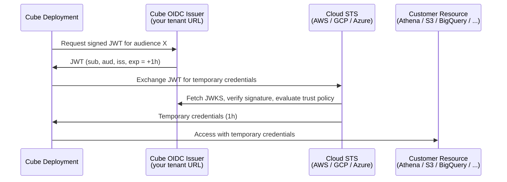

OIDC workload identity is Cube's keyless authentication mechanism. Cube acts
as an OpenID Connect (OIDC) identity provider for every deployment in your
account: it mints short-lived, signed JWTs that you federate with the systems
your deployment talks to. The system on the other side — AWS, GCP, Azure,
Snowflake, your own Bedrock-hosted LLM — verifies the token directly against
Cube's published JWKS and grants access, eliminating the need for long-lived
access keys, manual rotation, or shared secrets passed through Cube.

<Info>

Available on the [Enterprise plan](https://cube.dev/pricing).

</Info>

You can use OIDC workload identity to authenticate to:

- **Data sources** — AWS Athena, Redshift, BigQuery, Snowflake, and any other
  driver that supports federated credentials.
- **Export buckets** — S3 and GCS buckets used for `EXPORT_BUCKET` pre-aggregation
  unloads. OIDC covers Cube's download of the unloaded objects; the warehouse's
  `UNLOAD` write still needs its own credentials configured on the client side
  — see the per-cloud guides for details.
- **Cube Store CSPS** — a per-deployment S3, GCS, or Azure Blob Storage
  bucket that holds your Cube Store pre-aggregations (Customer-Supplied
  Pre-aggregation Storage).
- **Bring-your-own LLM providers** — AWS Bedrock, Google Vertex AI, and Azure
  OpenAI behind your own cloud account.
- **Other cloud services** — any cloud service that supports OIDC federation
  that you'd like to access from the dynamic part of your data model
  (`cube.py` / `cube.js`, dynamic schema generators, `checkAuth`, custom
  pre-aggregation strategies, etc.) — works with the same token.

The same mechanism powers all of these — the only thing that changes between
integrations is the trust policy on the receiving side and which IAM role,
service account, or app registration Cube assumes.

## How it works

If you're new to OpenID Connect, the [OpenID Connect Core 1.0
specification][link-oidc-spec] is the canonical reference; the
[OAuth.com OIDC primer][link-oidc-primer] is a friendlier read. Cube's
implementation is a standard OIDC provider — anything that works with
GitHub Actions OIDC, Vercel OIDC, or AWS IAM OIDC providers works the
same way here.

Each Cube tenant hosts a per-tenant OIDC issuer at its own domain, e.g.
`https://<tenant-name>.cubecloud.dev`. The issuer publishes the standard OIDC discovery
endpoints, and Cube signs every token with a KMS-backed RS256 key.



The deployment never sees an access key or service account JSON. The cloud
SDKs inside Cube — AWS SDK, GCP `google-auth-library`, Azure SDK — pick up
the token automatically from a path supplied by Cube and exchange it with
the cloud's own STS for short-lived credentials.

## Endpoints served by Cube

Each tenant's issuer URL is `https://<tenant-name>.cubecloud.dev`. Cube serves
the standard OIDC endpoints from that domain:

| Endpoint                                | Purpose                                                                                                |
| --------------------------------------- | ------------------------------------------------------------------------------------------------------ |
| `/.well-known/openid-configuration`     | OIDC discovery document. Cloud providers fetch this to learn the issuer, supported algorithms, and JWKS location. |
| `/.well-known/jwks.json`                | JSON Web Key Set. Contains the public keys cloud providers use to verify token signatures.            |

Both endpoints are unauthenticated, because they're consumed by AWS STS,
Google STS, Azure AD, and any other relying party that validates
Cube-issued tokens.

## Token configs

A **token config** is a tenant-level entry that tells Cube which audience to
mint tokens for and how to format the `sub` claim each token carries. Each
token config produces one audience-scoped JWT that is delivered to all
deployments in the tenant.

| Field                     | What it controls                                                                                                       |
| ------------------------- | ---------------------------------------------------------------------------------------------------------------------- |
| **Audience type**         | One of `AWS`, `GCP`, `Azure`, or `Custom`. `AWS` and `Azure` pre-fill the audience value.                               |
| **Audience**              | The JWT `aud` claim value. Pre-set for `AWS` (`sts.amazonaws.com`) and `Azure` (`api://AzureADTokenExchange`). For `GCP` you supply the **Workload Identity Federation provider resource path** (`//iam.googleapis.com/projects/.../providers/...`) — there is no global GCP audience. User-supplied for `Custom`. |
| **Name**                  | A short, filesystem-safe slug that becomes part of the token file name (`cube_cloud_token_<name>`).                     |
| **Subject Claim Format**  | Template for the JWT `sub` claim. Defaults to `cube:deployment:{deployment_id}` if left empty.                          |

You can have one config per well-known audience type (AWS, GCP, Azure) plus
any number of custom configs for tools like Snowflake or Databricks. A
deployment that integrates with several clouds simultaneously gets a separate
token file per audience — the Cube runtime picks the right one based on which
SDK is making the call.

### Subject claim format

The `sub` claim is what the receiving cloud provider's trust policy matches
on to decide which deployment or component is allowed to assume a role.
Cube's default template is `cube:deployment:{deployment_id}` — sufficient if
you only need to identify the deployment.

To scope further — by component (Cube API vs. Cube Store vs. the AI Engineer)
or by Cube Cloud region — override the template with one of the **Common
templates** the dialog offers:

- `cube:deployment:{deployment_id}` (default)
- `cube:deployment:{deployment_id}:component:{component}`
- `cube:deployment:{deployment_id}:component:{component}:region:{region}`

Three placeholders are supported anywhere in the template:

| Placeholder       | What it resolves to                                                 |
| ----------------- | ------------------------------------------------------------------- |
| `{deployment_id}` | The deployment's numeric ID. Substitutes to the literal `global` for tenant-scoped tokens (e.g., AI Engineer running in the control plane). |
| `{component}`     | The component requesting the token: `cube_api`, `cube_store`, or `ai_engineer`. Substitutes to `global` when no component context is set. |
| `{region}`        | The deployment's [Cube Cloud region][ref-cube-cloud-region]. For tenant-scoped tokens minted in the control plane, substitutes to the literal `control-plane`. |

The component values Cube emits are `cube_api` (the Cube API, refresh
worker, dev-mode pods, Cold Start Workers, etc.), `cube_store` (Cube Store),
and `ai_engineer` (the AI Engineer service, used for BYO LLM auth).

Outside of placeholders, the template may contain only the characters
`[A-Za-z0-9:_-]`. Anything else is rejected at save time.

<Frame>
  
</Frame>

<Warning>

Changing the subject claim format on a token config that's already in use
**will break customer trust policies that pin the old `sub` shape**. Update
the trust policy in your cloud account first, then change the format here.

</Warning>

<Note>

Subject claim format changes can take **up to one hour to fully propagate**.
Already-minted tokens are cached at several layers — the credentials broker
sidecar and the cloud SDKs' own STS-credential caches — and remain valid
until their TTL expires (up to 1h). Plan trust-policy rollouts so the new
`sub` shape is accepted before the old one stops being honored, and expect
a window where both formats are in flight.

</Note>

## Trust mechanism

The receiving system trusts Cube tokens by referencing two things:

1. **The issuer URL** — `https://<tenant-name>.cubecloud.dev`. The cloud
   provider fetches your tenant's JWKS from this URL and uses it to validate
   every token signature. As long as Cube holds the matching private key,
   tokens issued for your tenant verify; tokens issued by any other Cube
   tenant do not.
2. **The subject claim** — `sub`. The trust policy on the receiving side
   matches the `sub` exactly (or with wildcards) against the format you
   configured above to decide which deployments / components are allowed
   in.

## Token lifecycle

| Property              | Value                                                                                          |
| --------------------- | ---------------------------------------------------------------------------------------------- |
| **Algorithm**         | RS256                                                                                          |
| **TTL**               | 1 hour                                                                                         |
| **Refresh**           | Automatic — Cube re-mints each token before it expires and atomically replaces the token file. The cloud SDK on the other side picks up the new token without reconnecting. |
| **Signing keys**      | Per-tenant, KMS-backed. Rotated regularly; the JWKS endpoint always serves the current and previous public keys so in-flight tokens remain valid across rotations. |
| **Revocation**        | TTL-based. Emergency revocation is performed by rotating the signing key, which invalidates all tokens within the next TTL window.                                |

## Enabling OIDC for your tenant

Workload identity is configured at the **tenant** level under
**Admin → OIDC**. From there, you turn the issuer on and create one token
config per integration target.

<Steps>
  <Step title="Enable the OIDC issuer">
    In **Admin → OIDC**, flip the **OIDC token issuance is active for all
    deployments** switch to on. This activates the discovery and JWKS
    endpoints on your tenant URL and unlocks the deployment-level OIDC
    settings everywhere else in the UI. Click **OpenID Configuration** or
    **JWKS Endpoint** to grab the URLs you'll hand to your cloud provider
    when configuring federation.

    <Frame>
      
    </Frame>
  </Step>
  <Step title="Add token configs">
    Click **Add Config** and pick the audience type. For `AWS` and `Azure`,
    the audience auto-fills with the standard value. For `GCP`, enter the
    **Workload Identity Federation provider resource path** (the same
    `//iam.googleapis.com/projects/.../providers/...` value you use for
    `GCP_POOL_AUDIENCE`) — GCP has no global audience. For `Custom`, enter the
    audience your target system expects. Optionally set the **Subject Claim
    Format** — see [Token configs](#token-configs) for the available templates.
  </Step>
  <Step title="Configure trust on the cloud side">
    Follow the cloud-specific guides below to register Cube as an OIDC
    provider on the system you want Cube to access, create a role / service
    account / app registration, and write a trust policy that pins the
    issuer URL and the subject pattern.

    <CardGroup cols={3}>
      <Card title="Amazon Web Services" img="https://static.cube.dev/icons/aws.svg" href="/admin/deployment/oidc/aws">
        Athena, S3 export buckets, Bedrock, and any other AWS-IAM-protected service.
      </Card>
      <Card title="Google Cloud Platform" img="https://static.cube.dev/icons/google-cloud.svg" href="/admin/deployment/oidc/gcp">
        BigQuery, GCS export buckets, and any other GCP service via Workload Identity Federation.
      </Card>
      <Card title="Microsoft Azure" img="https://static.cube.dev/icons/azure.svg" href="/admin/deployment/oidc/azure">
        Azure SQL, Blob Storage export buckets, and any other Azure service via federated credentials.
      </Card>
    </CardGroup>
  </Step>
  <Step title="Set deployment identity environment variables">
    For each deployment, set the cloud-specific "who to become" env vars
    under **Settings → Environment variables**. These point Cube at the
    role or service account it should assume on your side:

    | Cloud | Env vars                                                          |
    | ----- | ----------------------------------------------------------------- |
    | AWS   | `AWS_ROLE_ARN`                                                    |
    | GCP   | `GCP_POOL_AUDIENCE`, `GCP_SERVICE_ACCOUNT_EMAIL`                  |
    | Azure | `AZURE_TENANT_ID`, `AZURE_CLIENT_ID`                              |

    These are the **default identity** for the deployment — see below.
  </Step>
</Steps>

## Default identity for a deployment

When you set `AWS_ROLE_ARN` (or the GCP / Azure equivalents) on a deployment,
that role becomes the default cloud identity for everything that runs inside
that deployment:

- **Drivers** that follow the AWS / GCP / Azure default credential chain
  (Athena, Redshift, BigQuery, RDS Postgres / MySQL with IAM auth, Azure SQL,
  and more) automatically authenticate as this role / service account.
- **Pre-aggregation export bucket I/O** uses the same identity to write to
  S3 / GCS / Blob Storage.
- **Code in your data model** — `dataSource` factories, `driverFactory`,
  `extendContext`, `checkAuth`, dynamic schema generators — runs with the same
  default identity. If you instantiate an AWS / GCP / Azure SDK client with no
  explicit credentials, it picks up the deployment's OIDC token automatically.

If you need a driver to talk to a different role or service account than the
deployment default — for example, the deployment's default role can read S3
but a specific Athena workgroup lives in a different account — set the
**driver-specific assume-role env var** in addition to the default. The
driver then uses the default identity to perform a second
`AssumeRole` / impersonation hop and connect as the downstream principal.

| Driver                 | Driver-specific assume-role env var                            |
| ---------------------- | -------------------------------------------------------------- |
| AWS Athena             | `CUBEJS_AWS_ATHENA_ASSUME_ROLE_ARN`                            |
| AWS Redshift           | `CUBEJS_DB_AWS_ROLE_ARN`                                       |
| Other AWS drivers      | Driver-specific — see the driver page in [Connect to data](/admin/connect-to-data/data-sources). |

The chain is always:

```
Cube OIDC token  →  default deployment identity  →  (optional) driver-specific assumed role
```

Most setups don't need the second hop — granting permissions directly to the
deployment's default role is simpler and easier to reason about.

## Cube Store CSPS

Cube Store can store its pre-aggregations in a **per-deployment** S3, GCS, or
Azure Blob Storage bucket that you own — Customer-Supplied Pre-aggregation
Storage (CSPS). When you enable CSPS for a deployment, Cube Store
authenticates to your bucket with the same OIDC machinery as the rest of the
deployment. The trust policy (AWS IAM role / Azure federated credential) pins
the `sub` claim to `cube:deployment:<deployment-id>:component:cube_store`,
giving Cube Store its own identity that's distinct from the Cube API.

CSPS is configured under **Settings → Pre-Aggregation Storage** on the
deployment. See
[AWS](/admin/deployment/oidc/aws#cube-store-csps-bucket),
[GCP](/admin/deployment/oidc/gcp#cube-store-csps-bucket), and
[Azure](/admin/deployment/oidc/azure#azure-blob-storage-csps-bucket) for the
trust policy shape on each cloud.

## Audit trail

Every token Cube issues is recorded in the tenant audit log with the
deployment ID, component, audience, and TTL. On the receiving side, the
cloud's own audit trail shows the federation event:

- **AWS CloudTrail** — `AssumeRoleWithWebIdentity` events with the deployment
  subject.
- **GCP Cloud Audit Logs** — Workload Identity Federation token-exchange and
  service-account-impersonation events.
- **Azure Activity Log** — Federated-credential sign-in events on the app
  registration.

Together these give you an end-to-end record of which deployment accessed
which resource and when, without ever issuing a long-lived credential.

[ref-oidc-aws]: /admin/deployment/oidc/aws
[ref-oidc-gcp]: /admin/deployment/oidc/gcp
[ref-oidc-azure]: /admin/deployment/oidc/azure
[ref-env-vars]: /admin/deployment#environment-variables
[ref-data-sources]: /admin/connect-to-data/data-sources
[ref-sub-editor]: /admin/deployment/oidc#subject-claim-format
[ref-cube-cloud-region]: /admin/deployment/infrastructure#what-is-a-cube-cloud-region
[link-oidc-spec]: https://openid.net/specs/openid-connect-core-1_0.html
[link-oidc-primer]: https://www.oauth.com/oauth2-servers/openid-connect/
