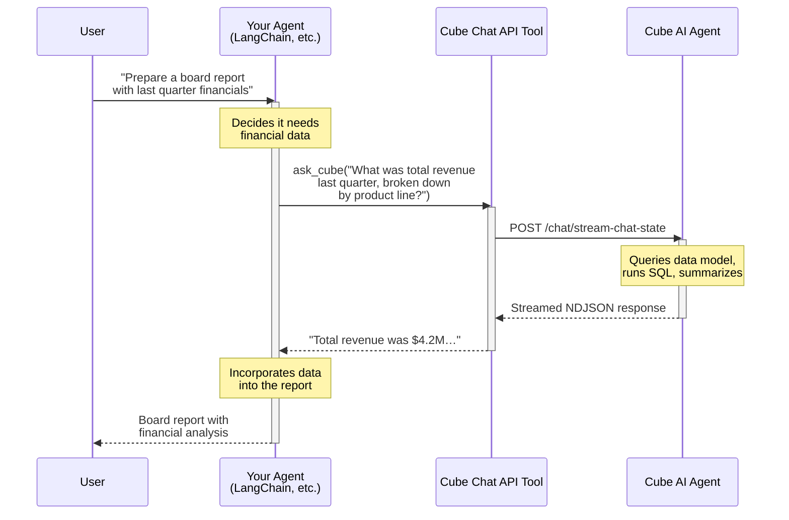

In this recipe, you will learn how to wrap the Cube [Chat API][ref-chat-api]
as a tool for an external AI agent, enabling agent-to-agent analytics
workflows.

## Use case

When building AI-powered applications, you often have an orchestrating agent
(built with frameworks like LangChain, LlamaIndex, or CrewAI) that handles
user conversations and coordinates multiple capabilities. One of these
capabilities might be answering data questions — revenue trends, customer
metrics, pipeline analysis, and so on.

Rather than building a custom data retrieval pipeline, you can give your
agent a tool that calls the Cube Chat API. This way, the Cube AI agent
handles the hard parts — understanding the data model, writing correct
queries, and summarizing results — while your orchestrating agent decides
*when* to ask data questions and how to fold the answers into its broader
workflow.

## Architecture

The following diagram shows how the orchestrating agent delegates data
questions to the Cube AI agent via the Chat API:



**Key benefits of this approach:**

- **Separation of concerns.** Your agent handles conversation flow and
  business logic; Cube handles data access, governance, and query
  optimization.
- **Built-in security.** Row-level security, data access policies, and
  user attributes are enforced by the Cube layer — your agent does not
  need to implement them.
- **Multi-turn context.** By reusing a `chatId`, the Cube agent retains
  conversational context, so follow-up questions like "now break that
  down by region" work automatically.

## Prerequisites

Before you begin, make sure you have:

- A Cube Cloud deployment on a [Premium or Enterprise plan](https://cube.dev/pricing)
- An AI agent configured in **Admin -> Agents**
- An [API key][ref-api-keys] with access to the agent
- The **Chat API URL** copied from your agent settings

## Implementation

### Wrapping the Chat API as a tool

The core idea is to write a function that sends a question to the Cube
Chat API, collects the streamed response, and returns the final answer
as a plain string. You then register this function as a tool that your
agent can invoke.

Here is a helper that calls the Chat API and extracts the final answer:

```python
import requests
import json

CUBE_CHAT_API_URL = "YOUR_CHAT_API_URL"
CUBE_API_KEY = "YOUR_API_KEY"


def query_cube_agent(question: str, chat_id: str | None = None) -> str:
    """Send a question to the Cube AI agent and return its final answer."""

    payload = {
        "input": question,
        "sessionSettings": {
            "externalId": "orchestrating-agent",
        },
    }
    if chat_id:
        payload["chatId"] = chat_id

    response = requests.post(
        CUBE_CHAT_API_URL,
        headers={
            "Content-Type": "application/json",
            "Authorization": f"Api-Key {CUBE_API_KEY}",
        },
        json=payload,
        stream=True,
    )
    response.raise_for_status()

    messages = []
    for line in response.iter_lines():
        if line:
            messages.append(json.loads(line.decode("utf-8")))

    # Extract the final answer from the stream
    final_messages = [
        msg
        for msg in messages
        if msg.get("role") == "assistant"
        and isinstance(msg.get("graphPath"), list)
        and len(msg["graphPath"]) > 0
        and msg["graphPath"][0] == "final"
        and len(msg["graphPath"]) <= 2
    ]

    if final_messages:
        return final_messages[-1].get("content", "")

    # Fallback: return the last assistant message with content
    for msg in reversed(messages):
        if msg.get("role") == "assistant" and msg.get("content"):
            return msg["content"]

    return "No answer received from the Cube agent."
```

<Info>

The function filters streamed messages for those where
`graphPath[0] === "final"` to get the consolidated answer. See the
[Chat API reference][ref-chat-api] for details on the response format.

</Info>

### LangChain integration

Below is a complete example of a LangChain agent that has access to the
Cube Chat API as a tool. When the agent decides it needs data to answer
a question, it calls the `ask_cube` tool automatically.

```python
import os
import requests
import json
from langchain_core.tools import tool
from langchain_openai import ChatOpenAI
from langgraph.prebuilt import create_react_agent

CUBE_CHAT_API_URL = os.environ["CUBE_CHAT_API_URL"]
CUBE_API_KEY = os.environ["CUBE_API_KEY"]


def query_cube_agent(question: str) -> str:
    """Send a question to the Cube AI agent and return its final answer."""

    response = requests.post(
        CUBE_CHAT_API_URL,
        headers={
            "Content-Type": "application/json",
            "Authorization": f"Api-Key {CUBE_API_KEY}",
        },
        json={
            "input": question,
            "sessionSettings": {
                "externalId": "orchestrating-agent",
            },
        },
        stream=True,
    )
    response.raise_for_status()

    messages = []
    for line in response.iter_lines():
        if line:
            messages.append(json.loads(line.decode("utf-8")))

    final_messages = [
        msg
        for msg in messages
        if msg.get("role") == "assistant"
        and isinstance(msg.get("graphPath"), list)
        and len(msg["graphPath"]) > 0
        and msg["graphPath"][0] == "final"
        and len(msg["graphPath"]) <= 2
    ]

    if final_messages:
        return final_messages[-1].get("content", "")

    for msg in reversed(messages):
        if msg.get("role") == "assistant" and msg.get("content"):
            return msg["content"]

    return "No answer received from the Cube agent."


@tool
def ask_cube(question: str) -> str:
    """Ask a data analytics question. Use this tool whenever you need
    business metrics, KPIs, trends, or any data from the company's
    databases. Pass a clear, self-contained question."""

    return query_cube_agent(question)


llm = ChatOpenAI(model="gpt-4o")
agent = create_react_agent(llm, [ask_cube])

result = agent.invoke(
    {
        "messages": [
            {
                "role": "user",
                "content": (
                    "Prepare a brief executive summary of last quarter's "
                    "performance. Include revenue, top products, and "
                    "month-over-month trends."
                ),
            }
        ]
    }
)

print(result["messages"][-1].content)
```

When you run this, the LangChain agent will:

1. Read the user's request and decide it needs data.
2. Call `ask_cube` with a focused data question (e.g., *"What was total
   revenue last quarter?"*).
3. Receive the Cube agent's answer with queried data and analysis.
4. Optionally call `ask_cube` again for additional data points.
5. Compose the final executive summary using all collected data.

### Passing user context

If your application has per-user data access policies, pass the
current user's identity and attributes through `sessionSettings` so that
the Cube agent enforces row-level security:

```python
def query_cube_agent_for_user(
    question: str,
    user_id: str,
    user_email: str | None = None,
    user_attributes: list[dict] | None = None,
) -> str:
    """Query the Cube agent with user-scoped permissions."""

    session_settings = {"externalId": user_id}
    if user_email:
        session_settings["email"] = user_email
    if user_attributes:
        session_settings["userAttributes"] = user_attributes

    response = requests.post(
        CUBE_CHAT_API_URL,
        headers={
            "Content-Type": "application/json",
            "Authorization": f"Api-Key {CUBE_API_KEY}",
        },
        json={
            "input": question,
            "sessionSettings": session_settings,
        },
        stream=True,
    )
    response.raise_for_status()

    # ... same response parsing as above ...
```

This way, a sales manager asking about revenue will only see data for
their territory, while a VP will see the full picture — without any
changes to your agent code.

### Multi-turn conversations

To maintain context across multiple questions in a single workflow, reuse
the `chatId` returned by the Cube Chat API:

```python
def query_cube_with_followup(questions: list[str]) -> list[str]:
    """Send a sequence of related questions, maintaining conversation context."""

    chat_id = None
    answers = []

    for question in questions:
        payload = {
            "input": question,
            "sessionSettings": {
                "externalId": "orchestrating-agent",
            },
        }
        if chat_id:
            payload["chatId"] = chat_id

        response = requests.post(
            CUBE_CHAT_API_URL,
            headers={
                "Content-Type": "application/json",
                "Authorization": f"Api-Key {CUBE_API_KEY}",
            },
            json=payload,
            stream=True,
        )
        response.raise_for_status()

        messages = []
        for line in response.iter_lines():
            if line:
                messages.append(json.loads(line.decode("utf-8")))

        # Capture the chatId for follow-up questions
        for msg in messages:
            if msg.get("id") == "__cutoff__" and msg.get("state", {}).get("chatId"):
                chat_id = msg["state"]["chatId"]

        final_messages = [
            msg
            for msg in messages
            if msg.get("role") == "assistant"
            and isinstance(msg.get("graphPath"), list)
            and len(msg["graphPath"]) > 0
            and msg["graphPath"][0] == "final"
            and len(msg["graphPath"]) <= 2
        ]

        if final_messages:
            answers.append(final_messages[-1].get("content", ""))
        else:
            answers.append("")

    return answers


# Example: ask a question and then a follow-up
answers = query_cube_with_followup([
    "What was total revenue last quarter?",
    "Now break that down by product line.",
])
```

With this approach, the second question — *"Now break that down by
product line"* — is understood in the context of the first, just like a
human conversation.

### Orchestrating multiple Cube agents

If your deployment uses [multi-agent][ref-multi-agent] — with specialized
Cube agents like a Sales Assistant and a Marketing Analyst living in the
same deployment — your orchestrating agent can choose the right Cube
agent for each question and route to it.

The [Chat API URL](#wrapping-the-chat-api-as-a-tool) embeds an `agentId`, so every agent in
your deployment has its own Chat API URL. Copy each one from **Admin →
Agents** for the corresponding agent. Switching between Cube agents
from your code is then just a matter of POSTing to a different URL —
the request shape is identical.

How your orchestrating agent learns which Cube agents exist is up to
you. Two common patterns:

- **List them in the system prompt.** Hardcode the agents (name,
  description, the domain each one covers) in your orchestrator's
  system prompt. Simple, and works well when the set of agents rarely
  changes.
- **Expose a discovery tool.** Add a `list_cube_agents` tool that
  returns the available agents at runtime. Useful when agents come and
  go, or when you want the orchestrator to pick them up without a code
  change.

The example below combines both: a `list_cube_agents` tool for
discovery and a single `ask_cube_agent` tool that takes an agent name
plus the question and routes the request to the matching Chat API URL.
It builds on the `query_cube_agent` helper from above, extended to
accept a `chat_api_url` argument instead of using a single hardcoded
URL.

```python
import json
import os
from langchain_core.tools import tool


CUBE_AGENTS = {
    "sales-assistant": {
        "url": os.environ["CUBE_SALES_AGENT_URL"],
        "description": (
            "Sales pipeline, deals, reps, quotas, and revenue by territory."
        ),
    },
    "marketing-analyst": {
        "url": os.environ["CUBE_MARKETING_AGENT_URL"],
        "description": (
            "Campaigns, channel attribution, traffic sources, and funnel "
            "conversion."
        ),
    },
}


@tool
def list_cube_agents() -> str:
    """List the available Cube agents and the domain each one covers.
    Call this first when you need data, then pick the most relevant
    agent for the user's question."""

    return json.dumps(
        {name: agent["description"] for name, agent in CUBE_AGENTS.items()}
    )


@tool
def ask_cube_agent(agent_name: str, question: str) -> str:
    """Ask a data analytics question to a specific Cube agent.

    Call `list_cube_agents` first to see which agents are available and
    which domain each one covers, then pass the chosen `agent_name`
    along with a focused, self-contained question."""

    agent = CUBE_AGENTS.get(agent_name)
    if agent is None:
        available = ", ".join(CUBE_AGENTS.keys())
        return (
            f"Unknown Cube agent '{agent_name}'. "
            f"Available agents: {available}."
        )

    return query_cube_agent(question, chat_api_url=agent["url"])
```

<Info>

Alternatively, skip the discovery tool entirely and inline the list of
agents and their domains in your orchestrator's system prompt. The
orchestrator will then pass an `agent_name` directly to `ask_cube_agent`
without an extra round trip.

</Info>

This pattern gives your orchestrating agent a clean routing layer: it
picks the right Cube agent for each question, and each Cube agent
answers using the rules, certified queries, and accessible views
configured for its [space][ref-spaces]. A sales question is routed to
the Sales Assistant and answered against the sales views; a marketing
question is routed to the Marketing Analyst and answered against the
marketing views — without your orchestrator needing to know any of
those details.


[ref-chat-api]: /reference/embed-apis/chat-api
[ref-api-keys]: /admin/account-billing/api-keys
[ref-multi-agent]: /admin/ai/multi-agent
[ref-spaces]: /admin/ai/multi-agent#spaces
