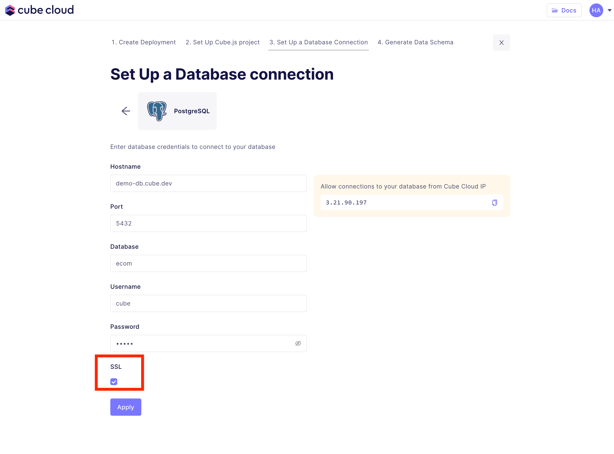
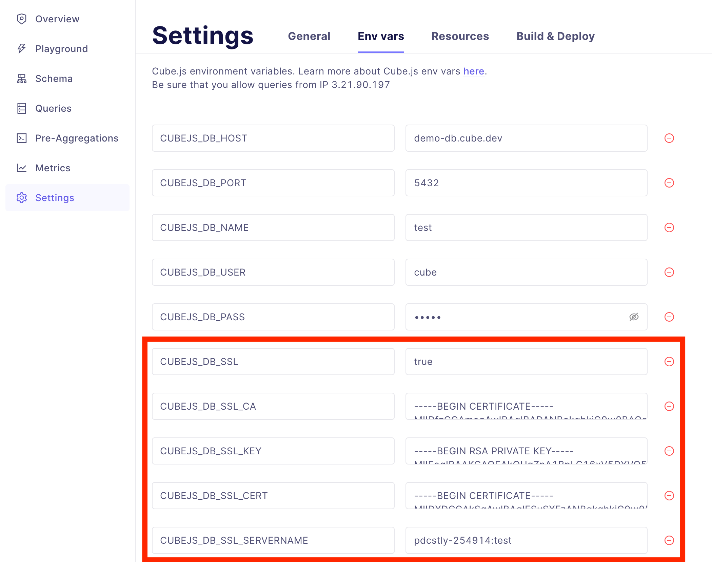

You can connect all Cube.js supported databases to your Cube Cloud deployment.

  

Below you can find guides on how to use Cube Cloud with specific database
vendors.

- Snowflake
- BigQuery
- AWS Athena

## Connecting to multiple databases

If you are connecting to multiple databases you can skip the database connection
step during the deployment creation. First, make sure you have the correct
configuration in your `cube.js` file according to your
[multitenancy setup](/multitenancy-setup). Next, configure the corresponding
environment variables on the **Settings - Env Vars page**.

## Connecting via SSL

When setting up a new deployment, simply select the SSL checkbox when entering
database credentials:

<!-- https://raw.githubusercontent.com/cube-js/cube.js/master/docs/content/Cube-Cloud/ -->

  

### Custom SSL certificates

To use custom SSL certificates between Cube Cloud and your database server, go to
the **Env vars** tab in **Settings**:

<!-- prettier-ignore-start -->
[[warning]]
| Depending on how SSL is configured on your database server, you may need to
| specify additional environment variables, please check the [Environment
| Variables reference][ref-config-env-vars] for more information.
<!-- prettier-ignore-end -->

  

Add the following environment variables:

| Environment Variable | Description | Example |
|----------------------|-------------|---------|
| `CUBEJS_DB_SSL`                                 | If `true`, enables SSL encryption for database connections from Cube.js                                                                                                                                     | `true`, `false`                                                  |
| `CUBEJS_DB_SSL_CA`                              | The contents of a CA bundle in PEM format, or a path to one. For more information, check the `options.ca` property for TLS Secure Contexts [in the Node.js documentation][link-nodejs-tls-options]          | A valid CA bundle or a path to one                               |
| `CUBEJS_DB_SSL_CERT`                            | The contents of an SSL certificate in PEM format, or a path to one. For more information, check the `options.cert` property for TLS Secure Contexts [in the Node.js documentation][link-nodejs-tls-options] | A valid SSL certificate or a path to one                         |
| `CUBEJS_DB_SSL_KEY`                             | The contents of a private key in PEM format, or a path to one. For more information, check the `options.key` property for TLS Secure Contexts [in the Node.js documentation][link-nodejs-tls-options]       | A valid SSL private key or a path to one                         |

[ref-config-env-vars]: /reference/environment-variables#database-connection

## Allowing connections from Cube Cloud IP

In some cases you'd need to allow connections from your Cube Cloud deployment IP
address to your database. You can copy the IP address from either the Database
Setup step in deployment creation, or from the Env Vars tab in your deployment
Settings page.

## Connecting to a database not exposed over the internet

[Contact us](mailto:support@cube.dev) for VPC peering and on-premise solutions.
