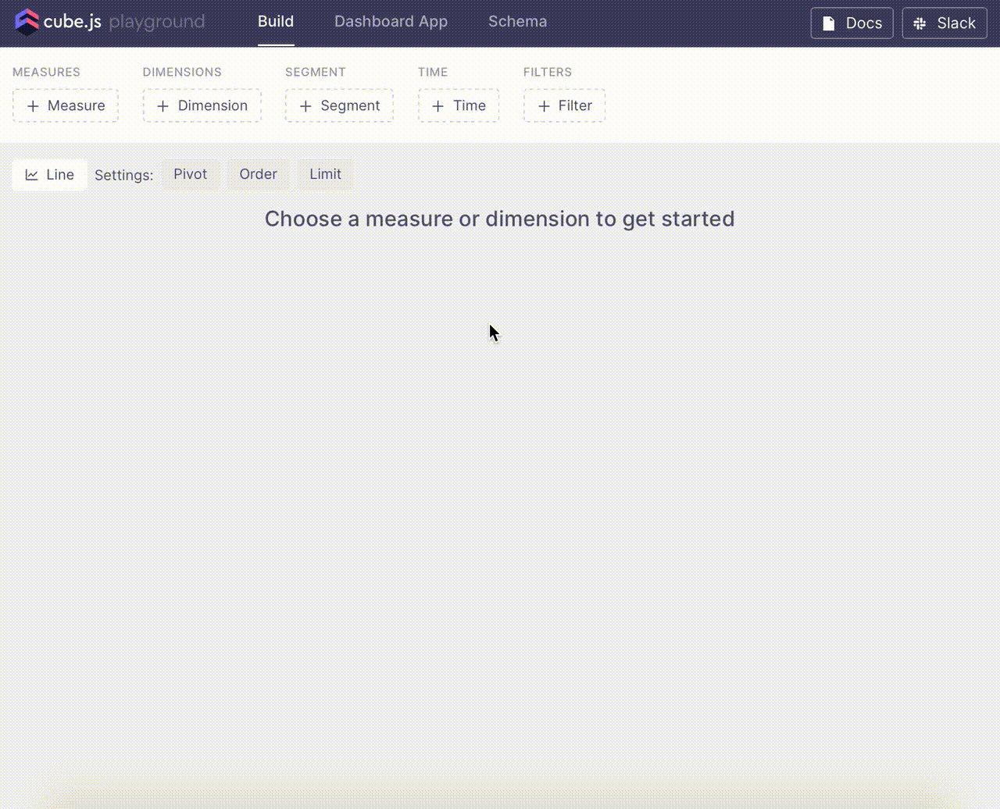

Developer Playground is a web-based tool which helps to generate and view the
data schema, build and execute queries, plot the results, and generate dashboard
applications from a variety of templates for different frontend frameworks and
data visualization libraries.

Developer Playground is available on `http://localhost:4000` when Cube.js is run
in [development mode][link-dev-mode]

Here's an example of building a query and plotting the results in Developer
Playground:

[link-dev-mode]: /configuration/overview
