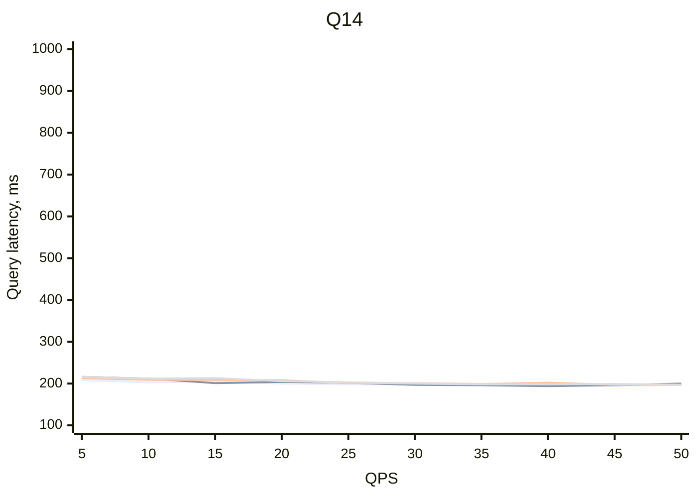
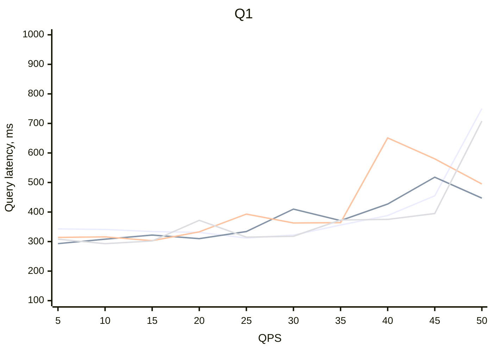
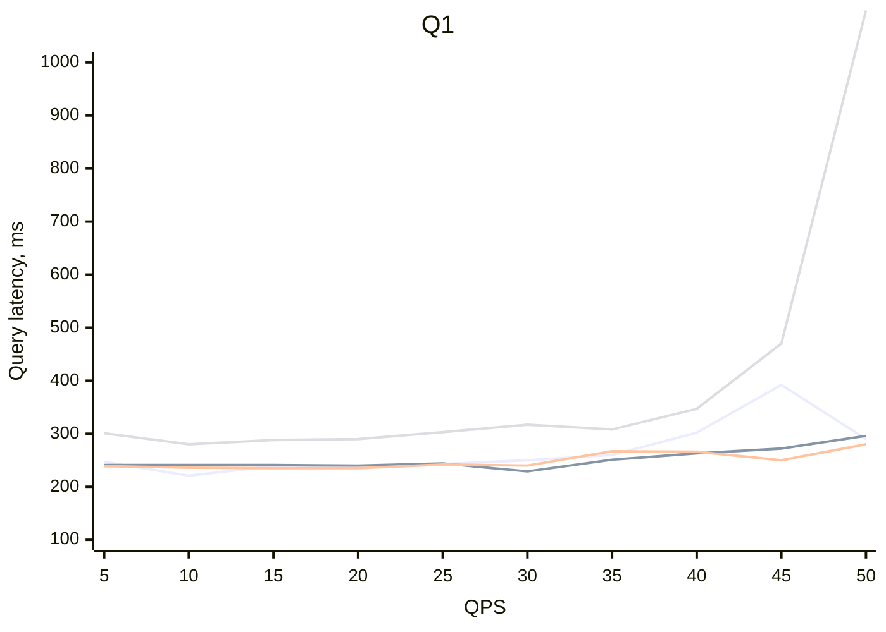
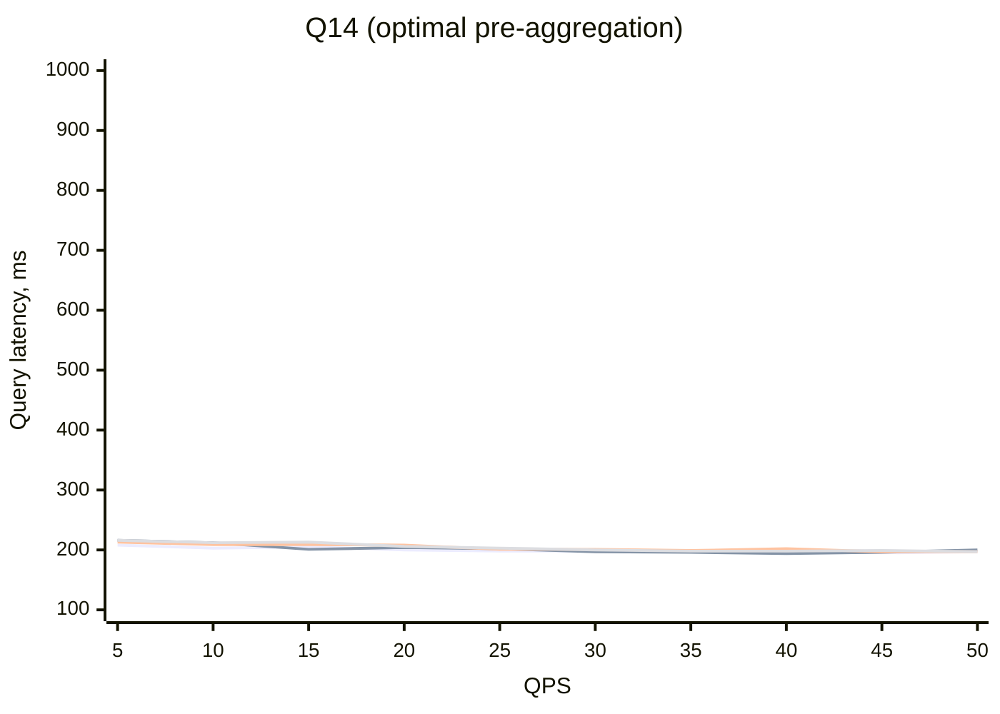
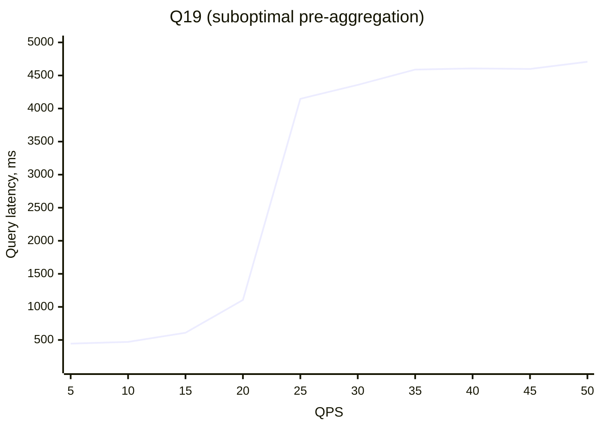
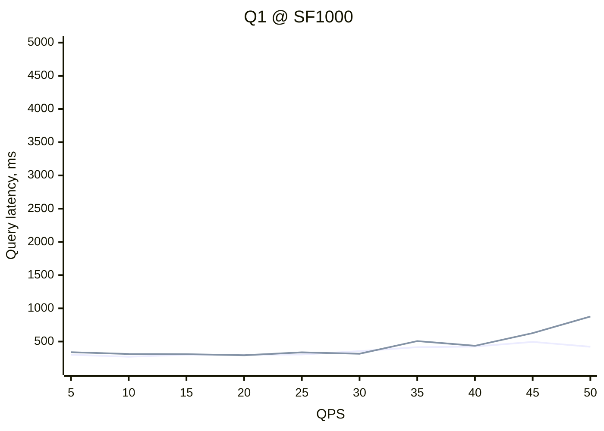
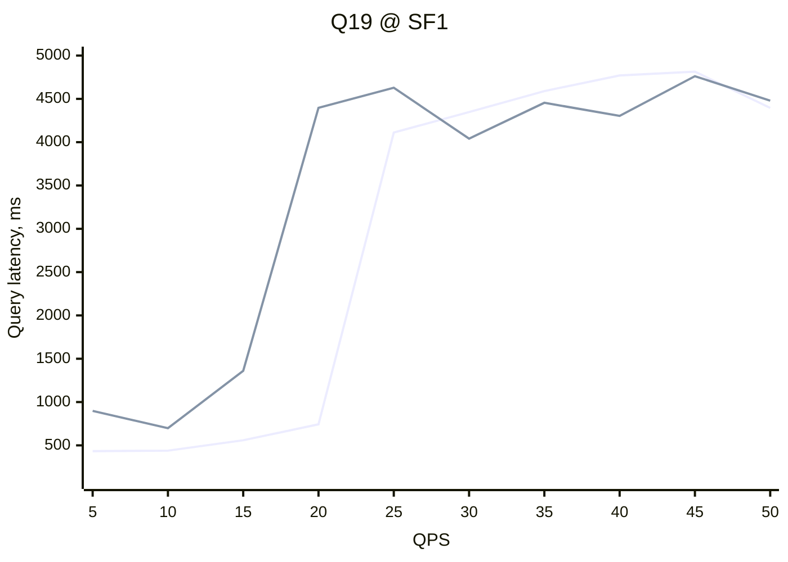

# Running TPC-H benchmark in Cube Cloud

[TPC-H benchmark][link-tpch-spec] is a standard benchmark for evaluating the performance
of OLAP systems. You can run the TPC-H benchmark in Cube Cloud to get insights into the
performance of [pre-aggregations][ref-pre-aggregations].

In this benchmark, the key performance indicator is the _query latency_.

Query latency was measured end-to-end by querying the SQL API. Network interaction
between the client and Cube Cloud accounts for ~100 ms of additional latency.

## Key insights

Related to running queries:

- Pre-aggregations are essential for low-latency queries.
- It is possible to achieve sub-second latency at [all scale factors](#scale-factors)
and QPS levels.
- Choice of [partitioning granularity](#partition-granularity) has a significant impact
on query latency, especially at higher QPS levels. For optimal performance, the query
should target a single partition.
- Pre-aggregations should be tailored to queries and indices should be introduced to make
sure that [all queries use optimal query plans](#optimal-and-suboptimal-pre-aggregations).
Suboptimal query plans lead to spikes in latency and ineffective use of Cube Store workers.

Related to building pre-aggregations:

- It is possible to build pre-aggregations within 10 minutes at all scale factors.
- [Conditional partitioning](#conditional-partitioning) can be used to achieve optimal
partitioning for datasets of different sizes.
- [Surrogate time dimensions](#partitioning-by-surrogate-time-dimensions) can be used
to partition pre-aggregations that don't have natural time dimensions.

## Results

### Scale factors

The following charts show the median query latency at different QPS levels for
different scale factors: `SF1` (light blue), `SF10` (dark blue), `SF100` (orange),
`SF1000` (gray).

Q14 demonstrates stable, low-latency performance at all scale factors and QPS levels.



Q1 demonstrates similar performance to Q14 at all scale factors and QPS levels below 35.



This is explained by the fact that Q1 filters by a time dimension with multi-year
date range:

```sql
-- Q1
SELECT
  l_returnflag,
  l_linestatus,
  MEASURE(sum_qty) AS sum_qty,
  MEASURE(sum_base_price) AS sum_base_price,
  MEASURE(sum_disc_price) AS sum_disc_price,
  MEASURE(sum_charge) AS sum_charge,
  MEASURE(avg_qty) AS avg_qty,
  MEASURE(avg_price) AS avg_price,
  MEASURE(avg_disc) AS avg_disc,
  MEASURE(count_order) AS count_order
FROM
  q1
WHERE
  l_shipdate >= date '1812-01-09'
  AND l_shipdate < date '1998-09-10'
GROUP BY
  l_returnflag,
  l_linestatus
ORDER BY
  l_returnflag,
  l_linestatus;
```

The relevant pre-aggregation is partitioned with yearly granularity:

```yaml
- name: q1
  dimensions:
    - lineitem.l_returnflag
    - lineitem.l_linestatus
  measures:
    - lineitem.sum_qty
    - lineitem.sum_base_price
    - lineitem.sum_disc_price
    - lineitem.sum_charge
    - lineitem.sum_discount
    - lineitem.count_order
  time_dimension: lineitem.l_shipdate
  # According to 2.4.1.2-2.4.1.3 in the TPC-H specification, the granularity should be 'day'
  granularity: day
  partition_granularity: year
  refresh_key:
    every: 1 week
```

Subsequently, the generated query references multiple partitions, requiring that
multiple Cube Store workers scan multiple partitions in parallel.

```sql
SELECT
  `lineitem__l_returnflag` `q1__l_returnflag`,
  `lineitem__l_linestatus` `q1__l_linestatus`,
  sum(`lineitem__sum_qty`) `q1__sum_qty`,
  sum(`lineitem__sum_base_price`) `q1__sum_base_price`,
  sum(`lineitem__sum_disc_price`) `q1__sum_disc_price`,
  sum(`lineitem__sum_charge`) `q1__sum_charge`,
  sum(`lineitem__sum_qty`) / sum(`lineitem__count_order`) `q1__avg_qty`,
  sum(`lineitem__sum_base_price`) / sum(`lineitem__count_order`) `q1__avg_price`,
  sum(`lineitem__sum_discount`) / sum(`lineitem__count_order`) `q1__avg_disc`,
  sum(`lineitem__count_order`) `q1__count_order`
FROM (
  SELECT * FROM sf_sf_1.lineitem_q119920101_rk3lu1qg_oaw2gmzm_1jvd503 UNION ALL
  SELECT * FROM sf_sf_1.lineitem_q119930101_4ujj43bb_a2oqqzg0_1jvd503 UNION ALL
  SELECT * FROM sf_sf_1.lineitem_q119940101_nqzhzesq_qvux03en_1jvd503 UNION ALL
  SELECT * FROM sf_sf_1.lineitem_q119950101_vfpnks2s_hyehh1vu_1jvd503 UNION ALL
  SELECT * FROM sf_sf_1.lineitem_q119960101_bqc3xgl_j4jophsc_1jvd503  UNION ALL
  SELECT * FROM sf_sf_1.lineitem_q119970101_cyl2fzr4_mspdbvej_1jvd503 UNION ALL
  SELECT * FROM sf_sf_1.lineitem_q119980101_plk5xqjx_1tvzmra5_1jvd503
) AS `lineitem__q1`
WHERE (
  `lineitem__l_shipdate_day` >= to_timestamp('1812-01-09T00:00:00.000')
  AND `lineitem__l_shipdate_day` <= to_timestamp('1998-09-09T23:59:59.999')
)
GROUP BY 1, 2
ORDER BY 1 ASC, 2 ASC
LIMIT 50000
```

### Partition granularity

The following chart shows the query latency for Q1 in case it hits a pre-aggregation
with yearly partitions at all scale factors. It means that fulfilling each query
requires scanning 7 partitions, involving 7 Cube Store workers.


Here's an example generated query:

```sql
SELECT
  `lineitem__l_returnflag` `q1__l_returnflag`,
  `lineitem__l_linestatus` `q1__l_linestatus`,
  sum(`lineitem__sum_qty`) `q1__sum_qty`,
  sum(`lineitem__sum_base_price`) `q1__sum_base_price`,
  sum(`lineitem__sum_disc_price`) `q1__sum_disc_price`,
  sum(`lineitem__sum_charge`) `q1__sum_charge`,
  sum(`lineitem__sum_qty`) / sum(`lineitem__count_order`) `q1__avg_qty`,
  sum(`lineitem__sum_base_price`) / sum(`lineitem__count_order`) `q1__avg_price`,
  sum(`lineitem__sum_discount`) / sum(`lineitem__count_order`) `q1__avg_disc`,
  sum(`lineitem__count_order`) `q1__count_order`
FROM (
  SELECT * FROM sf_sf_1000.lineitem_q119920101_1q2zedr4_ie2iwpfm_1jvd4tm UNION ALL
  SELECT * FROM sf_sf_1000.lineitem_q119930101_1qavul1i_ljfbibef_1jvd4tm UNION ALL
  SELECT * FROM sf_sf_1000.lineitem_q119940101_grqcqd4h_3vtvvejs_1jvd4tm UNION ALL
  SELECT * FROM sf_sf_1000.lineitem_q119950101_mgbnpe4y_oaetpdn5_1jvd4tm UNION ALL
  SELECT * FROM sf_sf_1000.lineitem_q119960101_hcf4rpac_aowipfy1_1jvcp5f UNION ALL
  SELECT * FROM sf_sf_1000.lineitem_q119970101_3zez3c2z_zshi5vky_1jvcotv UNION ALL
  SELECT * FROM sf_sf_1000.lineitem_q119980101_4va5ajty_es5zmwrx_1jvcot0
) AS `lineitem__q1`
WHERE (
  `lineitem__l_shipdate_day` >= to_timestamp('1860-08-22T00:00:00.000')
  AND `lineitem__l_shipdate_day` <= to_timestamp('1998-08-08T23:59:59.999')
)
GROUP BY 1, 2
ORDER BY 1 ASC, 2 ASC
LIMIT 50000
```

The following chart shows the query latency for Q1 in case it hits a pre-aggregation
with yearly partitions at `SF1000` and hits pre-aggregation without partitioning at all
other scale factors. It means that fulfilling each query for `SF1`, `SF10`, and `SF100`
requires scanning a single partition, performed by a single Cube Store worker:



Compare the generated query:

```sql
SELECT
  `lineitem__l_returnflag` `q1__l_returnflag`,
  `lineitem__l_linestatus` `q1__l_linestatus`,
  sum(`lineitem__sum_qty`) `q1__sum_qty`,
  sum(`lineitem__sum_base_price`) `q1__sum_base_price`,
  sum(`lineitem__sum_disc_price`) `q1__sum_disc_price`,
  sum(`lineitem__sum_charge`) `q1__sum_charge`,
  sum(`lineitem__sum_qty`) / sum(`lineitem__count_order`) `q1__avg_qty`,
  sum(`lineitem__sum_base_price`) / sum(`lineitem__count_order`) `q1__avg_price`,
  sum(`lineitem__sum_discount`) / sum(`lineitem__count_order`) `q1__avg_disc`,
  sum(`lineitem__count_order`) `q1__count_order`
FROM sf_sf_100.lineitem_q1_45fndzrm_1dlnn2a3_1jvdn89 AS `lineitem__q1`
WHERE (
  `lineitem__l_shipdate_day` >= to_timestamp('1886-02-15T00:00:00.000')
  AND `lineitem__l_shipdate_day` <= to_timestamp('1998-08-22T23:59:59.999')
)
GROUP BY 1, 2
ORDER BY 1 ASC, 2 ASC
LIMIT 50000
```

You can see that fulfilling the query via a single Cube Store worker allows to visibly
reduce the query latency. Also, at higher QPS levels, the difference is even more
pronounced; beyond 40 QPS, the query latency quickly grows, indicating lack of readily
available Cube Store workers.


### Optimal and suboptimal pre-aggregations

Compare results for Q14, matching an optimal pre-aggregation, and Q19, matching a
[suboptimal][ref-cache-type] pre-aggregation.

Q14 demonstrates stable, low-latency performance at all scale factors.



This is explained by the fact that Q14 only filters by a time dimension:

```sql
-- Q14
SELECT MEASURE(promo_revenue) AS promo_revenue
FROM q14
WHERE
  l_shipdate >= date '1996-01-01'
  AND l_shipdate < date '1996-02-01';
```

The pre-aggregation for Q14 is partitioned by that very time dimension with yearly
granularity:

```yaml
- name: q14
  measures:
    - lineitem.q14_promo_revenue_absolute
    - lineitem.sum_disc_price
  time_dimension: lineitem.l_shipdate
  # According to 2.4.14.2-2.4.14.3 in the TPC-H specification, the granularity can be 'month'
  granularity: month
  partition_granularity: year
  refresh_key:
    every: 1 week
```

Indeed, the generated query references a single partition, allowing Cube Store to
fulfill the query with a single partition scan, performed by a single Cube Store worker:

```sql
SELECT 100.00 * sum(`lineitem__q14_promo_revenue_absolute`) / sum(`lineitem__sum_disc_price`) `q14__promo_revenue`
FROM sf_sf_10.lineitem_q1419960101_klx5d2d3_t1redyfh_1jvcoq3 AS `lineitem__q14`
WHERE (
  `lineitem__l_shipdate_month` >= to_timestamp('1996-01-01T00:00:00.000')
  AND `lineitem__l_shipdate_month` <= to_timestamp('1996-01-31T23:59:59.999')
)
LIMIT 50000
```

Unlike Q14, Q19 shows a sharp increase in latency as soon as QPS exceeds 20 at `SF1`; with other
scale factors, the latency is beyond reasonable limits at all QPS levels.



This is explained by the fact that Q19 filters by complex conditions on multiple dimensions:

```sql
-- Q19
SELECT MEASURE(revenue) AS revenue
FROM q19
WHERE (
  (
    p_brand = 'Brand#13'
    AND p_container IN ('SM CASE', 'SM BOX', 'SM PACK', 'SM PKG')
    AND l_quantity >= 4.995608
    AND l_quantity <= 5.004392 + 10
    AND p_size BETWEEN 1
    AND 5
    AND l_shipmode IN ('AIR', 'AIR REG')
    AND l_shipinstruct = 'DELIVER IN PERSON'
  )
  OR (
    p_brand = 'Brand#43'
    AND p_container IN ('MED BAG', 'MED BOX', 'MED PKG', 'MED PACK')
    AND l_quantity >= 13.99645
    AND l_quantity <= 14.00355 + 10
    AND p_size BETWEEN 1
    AND 10
    AND l_shipmode IN ('AIR', 'AIR REG')
    AND l_shipinstruct = 'DELIVER IN PERSON'
  )
  OR (
    p_brand = 'Brand#54'
    AND p_container IN ('LG CASE', 'LG BOX', 'LG PACK', 'LG PKG')
    AND l_quantity >= 22.994363
    AND l_quantity <= 23.005637 + 10
    AND p_size BETWEEN 1
    AND 15
    AND l_shipmode IN ('AIR', 'AIR REG')
    AND l_shipinstruct = 'DELIVER IN PERSON'
  )
);
```

The pre-aggregation for Q19 is partitioned by the `part.q19_surrogate_time` dimension
that was introduced in order to optimize pre-aggregation builds. Without partitioning,
the pre-aggregation would have been too large to build within 10 minutes.

```yaml
- name: q19
  dimensions:
    - part.p_brand
    - lineitem.l_shipinstruct
    - part.p_container
    - lineitem.l_shipmode
    - lineitem.l_quantity
    - part.p_size
  measures:
    - lineitem.sum_disc_price
  time_dimension: part.q19_surrogate_time
  granularity: day
  partition_granularity: day
  refresh_key:
    every: 1 week 
```

The generated query references multiple partitions, requiring that multiple Cube Store
workers scan multiple partitions in parallel and perform filtering without using indices.
It results in lots of compute resources being used for a single query, which leads to
accumulation of the [wait time for queries][ref-perf-insights-cube-store], and
subsequent sharp increase in latency.

```sql
SELECT sum(`lineitem__sum_disc_price`) `q19__revenue`
FROM (
  SELECT * FROM sf_sf_1.lineitem_q1920000109_224onxv1_qf3oogew_1jva6s2 UNION ALL
  SELECT * FROM sf_sf_1.lineitem_q1920000110_rbr2amsq_4vjstoht_1jva6s2 UNION ALL
  SELECT * FROM sf_sf_1.lineitem_q1920000111_oflsi5m3_xsejqrcw_1jva6s2 UNION ALL
  SELECT * FROM sf_sf_1.lineitem_q1920000112_docgmmaf_4vhu2wuu_1jva6s2 UNION ALL
  SELECT * FROM sf_sf_1.lineitem_q1920000113_xvngml2o_51ix23ul_1jva6s2 UNION ALL
  SELECT * FROM sf_sf_1.lineitem_q1920000114_eykl5mpn_zbrozcbu_1jva6s2 UNION ALL
  SELECT * FROM sf_sf_1.lineitem_q1920000115_t0ecz20i_2bfpap2z_1jva6s2 UNION ALL
  SELECT * FROM sf_sf_1.lineitem_q1920000116_int0ec4g_xzqmgci4_1jva6s2 UNION ALL
  SELECT * FROM sf_sf_1.lineitem_q1920000117_t2hfgmaw_kywfzp3y_1jva6s2 UNION ALL
  SELECT * FROM sf_sf_1.lineitem_q1920000118_f0012sh3_x3klqirv_1jva6s2 UNION ALL
  SELECT * FROM sf_sf_1.lineitem_q1920000119_i5w5t4gl_mbvnfroi_1jva6s2 UNION ALL
  SELECT * FROM sf_sf_1.lineitem_q1920000120_jc5oj1nu_2r4yqt3n_1jva6s2 UNION ALL
  SELECT * FROM sf_sf_1.lineitem_q1920000121_ejv51yzh_rckvr5gk_1jva6s2 UNION ALL
  SELECT * FROM sf_sf_1.lineitem_q1920000122_czvoak1x_kl3lfixq_1jva6s2 UNION ALL
  SELECT * FROM sf_sf_1.lineitem_q1920000123_e0q2t43d_5b1z0i22_1jva6s2 UNION ALL
  SELECT * FROM sf_sf_1.lineitem_q1920000124_uwbpfvce_cl5tlnoo_1jva6s2 UNION ALL
  SELECT * FROM sf_sf_1.lineitem_q1920000125_p21lk1sy_onkgdcmn_1jva6s2 UNION ALL
  SELECT * FROM sf_sf_1.lineitem_q1920000126_0slbv0l5_xlfqc2sh_1jva6s2 UNION ALL
  SELECT * FROM sf_sf_1.lineitem_q1920000127_p20btooz_yyfd0ozq_1jva6s2 UNION ALL
  SELECT * FROM sf_sf_1.lineitem_q1920000128_fiwymlxc_3p4msu1e_1jva6s2 UNION ALL
  SELECT * FROM sf_sf_1.lineitem_q1920000129_hnq2242u_zusqioiq_1jva6s2 UNION ALL
  SELECT * FROM sf_sf_1.lineitem_q1920000130_b3w5p0qv_u0fje3oc_1jva6s2
) AS `lineitem__q19`
WHERE
  (
    (
      (`part__p_brand` = 'Brand#13')
      AND (
        `part__p_container` IN ('SM CASE', 'SM BOX', 'SM PACK', 'SM PKG')
      )
      AND (`lineitem__l_quantity` >= '4.995608')
      AND (`lineitem__l_quantity` <= '15.004392')
      AND (`part__p_size` >= '1')
      AND (`part__p_size` <= '5')
      AND (`lineitem__l_shipmode` IN ('AIR', 'AIR REG'))
      AND (`lineitem__l_shipinstruct` = 'DELIVER IN PERSON')
    )
    OR (
      (`part__p_brand` = 'Brand#43')
      AND (
        `part__p_container` IN ('MED BAG', 'MED BOX', 'MED PKG', 'MED PACK')
      )
      AND (`lineitem__l_quantity` >= '13.99645')
      AND (`lineitem__l_quantity` <= '24.00355')
      AND (`part__p_size` >= '1')
      AND (`part__p_size` <= '10')
      AND (`lineitem__l_shipmode` IN ('AIR', 'AIR REG'))
      AND (`lineitem__l_shipinstruct` = 'DELIVER IN PERSON')
    )
    OR (
      (`part__p_brand` = 'Brand#54')
      AND (
        `part__p_container` IN ('LG CASE', 'LG BOX', 'LG PACK', 'LG PKG')
      )
      AND (`lineitem__l_quantity` >= '22.994363')
      AND (`lineitem__l_quantity` <= '33.005637')
      AND (`part__p_size` >= '1')
      AND (`part__p_size` <= '15')
      AND (`lineitem__l_shipmode` IN ('AIR', 'AIR REG'))
      AND (`lineitem__l_shipinstruct` = 'DELIVER IN PERSON')
    )
  )
  AND (
    `part__q19_surrogate_time_day` >= to_timestamp('2000-01-09T00:00:00.000')
    AND `part__q19_surrogate_time_day` <= to_timestamp('2000-01-30T23:59:59.999')
  )
LIMIT 50000
```

<!-- TODO

### Cube Store cluster size





-->

## Overview

### Datasets

For convenience, [TPC-H datasets][link-snowflake-tpch-dataset], provided publicly
by Snowflake, were used. They come with the following scale factors that determine
the size of the dataset:

| Scale factor | Dataset size | Rows in `LINEITEM` table |
| --- | --- | --- |
| `SF1` | 0.25 GB | 6 million |
| `SF10` | 2.5 GB | 60 million |
| `SF100` | 25 GB | 600 million |
| `SF1000` | 250 GB | 6 billion |

### Configuration

Results below are collected by running queries against a production cluster with
10 API instances and 8 Cube Store workers, unless otherwise specified.

See the source code and instructions in the [GitHub repository][link-github-tpch-benchmark].

### Building pre-aggregations

The following techniques were used to allow building pre-aggregations within 10 minutes
for all scale factors.

#### Conditional partitioning

It enables pre-aggregation builds within 10 minutes at greater scale factors without
compromising on querying performance and the query latency for smaller scale factors.

Without conditional partitioning, the pre-aggregation for Q1 would fail to build at
`SF1000` within 10 minutes:


This is not an issue with conditional partitioning:

```yaml
- name: q1
  dimensions:
    - lineitem.l_returnflag
    - lineitem.l_linestatus
  measures:
    - lineitem.sum_qty
    - lineitem.sum_base_price
    - lineitem.sum_disc_price
    - lineitem.sum_charge
    - lineitem.sum_discount
    - lineitem.count_order
  time_dimension: lineitem.l_shipdate
  # According to 2.4.1.2-2.4.1.3 in the TPC-H specification, the granularity should be 'day'
  granularity: day
  
  partition_granularity: year
  
  refresh_key:
    every: 1 week 
```

#### Partitioning by surrogate time dimensions

It enables partitioning of pre-aggregations that don't have natural time dimensions
and allows building pre-aggregations within 10 minutes at greater scale factors.

```yaml
      - name: q17_surrogate_time
        sql: >
          DATEADD(
            day,
            SUBSTRING(P_BRAND, 7, 1) * 5 + SUBSTRING(P_BRAND, 8, 1),
            '2000-01-01'
          )::TIMESTAMP
        type: time
        description: >
          For Q17. Surrogate time dimension that lets the pre-aggregation to be partitioned.
          See `query_rewrite` in `cube.py`
```

```yaml
- name: q17
  dimensions:
    - part.p_container
    - part.p_brand
    - lineitem.q17_threshold
  measures:
    - lineitem.sum_base_price
  time_dimension: part.q17_surrogate_time
  granularity: day
  partition_granularity: day
  indexes:
    - name: main
      columns:
        - part.p_container
        - part.p_brand
        - lineitem.q17_threshold
  refresh_key:
    every: 1 week
```

```python
import os
import re
import json
from datetime import datetime, timedelta
from cube import config

def add_time_dimension_filter(view: str, query: dict) -> dict:
  if 'measures' in query and any(m.startswith(f"{view}.") for m in query['measures']):
    pattern = r'Brand#(\d)(\d)'
    matches = re.findall(pattern, json.dumps(query['filters']))
    base_date = datetime(2000, 1, 1)
    dates = []

    for match in matches:
      days_to_add = (int(match[0]) * 5) + int(match[1])
      date_start = base_date + timedelta(days=days_to_add)
      date_end = date_start + timedelta(days=1) - timedelta(milliseconds=1)
      dates.append(date_start)
      dates.append(date_end)
      
    query['timeDimensions'].append({
      'dimension': f"part.{view}_surrogate_time",
      'dateRange': [min(dates).isoformat(), max(dates).isoformat()]
    })

  return query

@config('query_rewrite')
def query_rewrite(query: dict, ctx: dict) -> dict:
  query = add_time_dimension_filter('q17', query)
  query = add_time_dimension_filter('q19', query)
  return query
```


[link-tpch-spec]: https://www.tpc.org/TPC_Documents_Current_Versions/pdf/TPC-H_v3.0.1.pdf
[link-snowflake-tpch-dataset]: https://docs.snowflake.com/en/user-guide/sample-data-tpch
[link-github-tpch-benchmark]: https://github.com/cubedevinc/benchmarks
[ref-pre-aggregations]: /product/caching/using-pre-aggregations
[ref-cache-type]: /product/caching#cache-type
[ref-perf-insights-cube-store]: /product/workspace/performance#cube-store