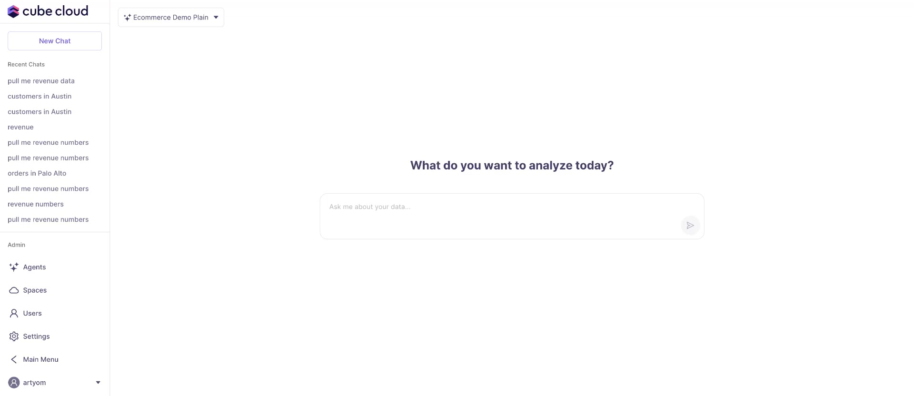
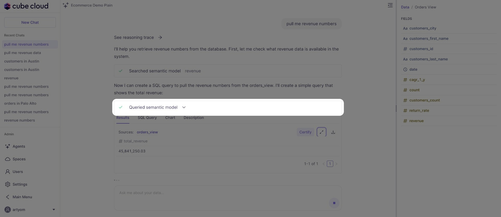
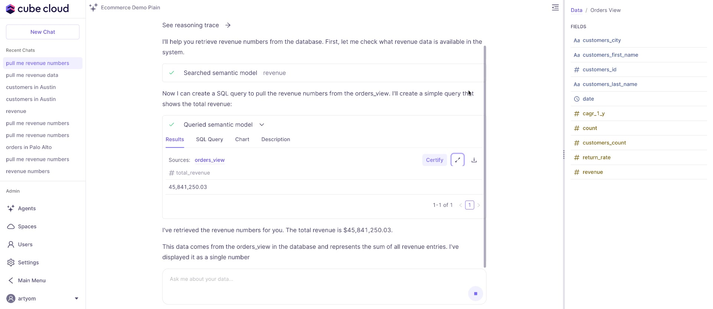
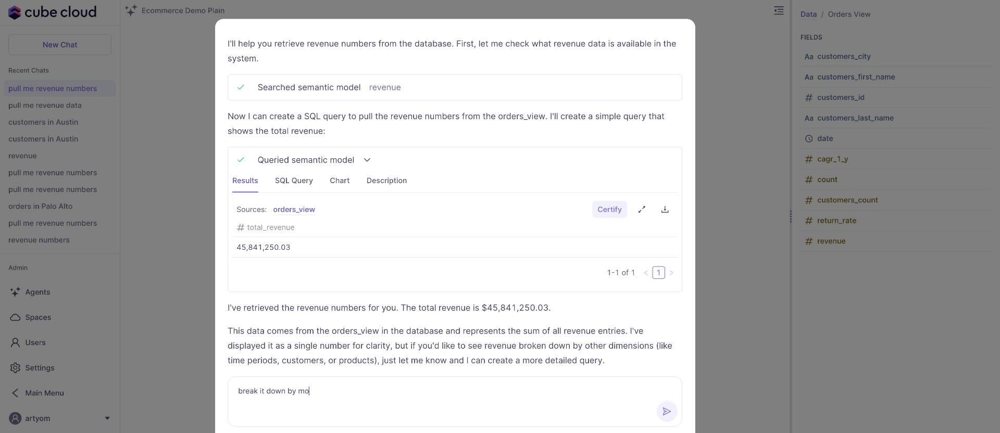
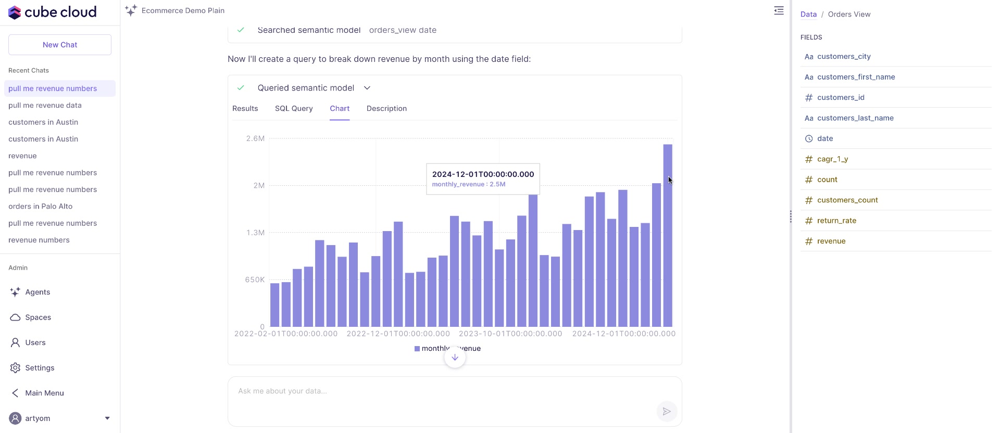
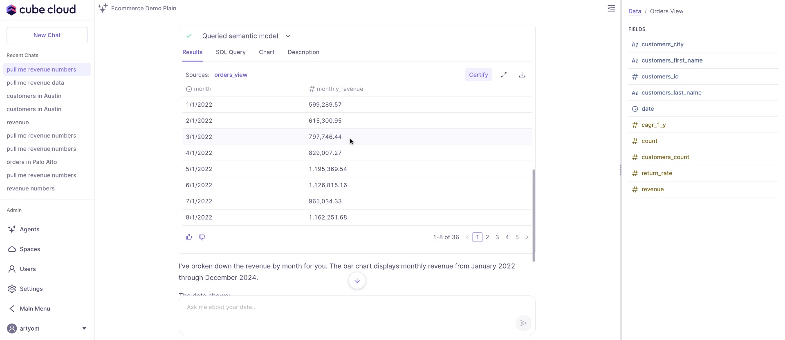

## Overview

Learn to analyze revenue data using Cube's interactive features, including charts, tables, and SQL queries.

## Starting an Analysis

Type your analysis request into the textbox in the main area.

Click the `Button` to begin the analysis.

## Viewing and Interacting with Results

View the total revenue number.

The system shows the steps taken to retrieve the data, including the semantic model searched and the queried semantic model.

View a summary of the retrieved revenue numbers, with a message explaining the data's origin and representation.

Provide feedback on the results using the thumbs up/down icons. This feedback helps Cube learn and improve future results.

### Viewing Data in Tables and Charts

The initial view shows a summary of the total revenue.

Click the `Break it down by month` button to view monthly revenue data in a table. Click `Certify` to confirm the results. Click `Download` to download the data.

Click the `Chart` tab to switch to a chart view of the monthly revenue data.

You can switch from the chart view to the table view.

Use the pagination controls to navigate through the data.

### Customizing SQL Queries

You can open reports in full screen.

Click `Edit SQL Query` to view and edit the underlying SQL query for the chart.

You can send the query to chat.

You can edit the query, including changing the `ORDER BY` clause via the dropdown menu.

The right side shows available fields to add to the query.

The SQL query can include a `LAG` function to calculate prior month revenue.

A sidebar shows available fields to include in the query.