## Overview

Manage Cube's settings, spaces, and agents to customize your data analysis experience.

## Admin Panel

Access the admin panel through the `Main Menu` sidebar on the left of the home screen.

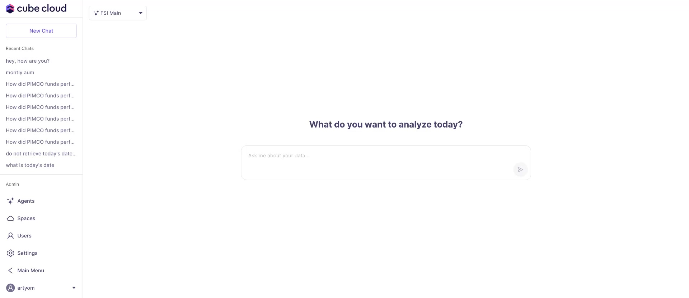

### User Management

To manage users, select `Users` in the sidebar.

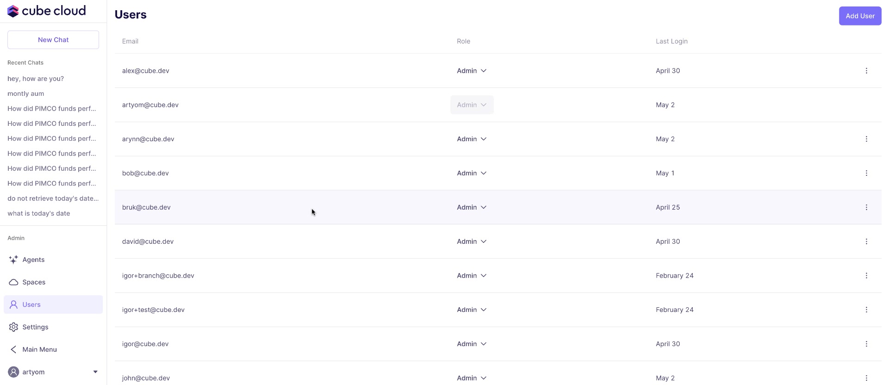

You will see a table view of users, their email addresses, roles, and last login times.

To change a user's role, select a new role from the dropdown menu next to their name.

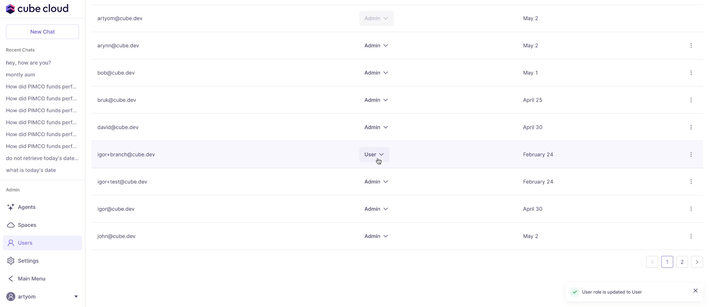

You will see a success message upon updating the role.

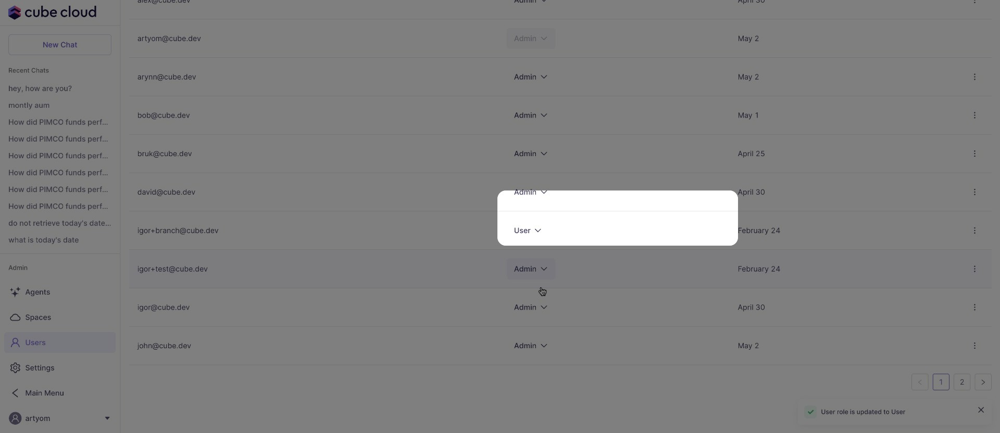

Use the pagination controls to navigate through multiple pages of users, if needed.

### Global Settings

To access global settings, select `Settings` in the sidebar.

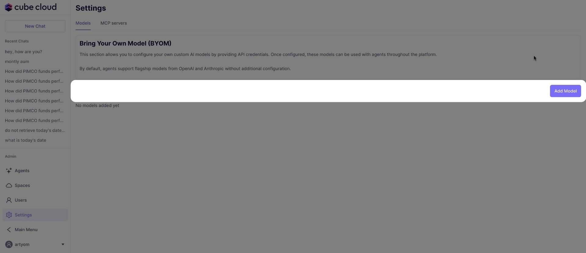

Configure custom AI models in the "Bring Your Own Model (BYOM)" section.

Click `Add Model` to open the new model modal.

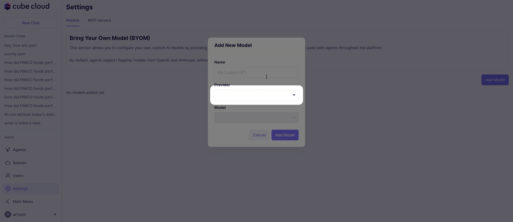

Specify the `Name`, select the `Provider` and the `Model` from the dropdown menus.

You may need to enter your `Region`, `Access Key ID`, and `Secret Access Key`, depending on the model and provider you choose.

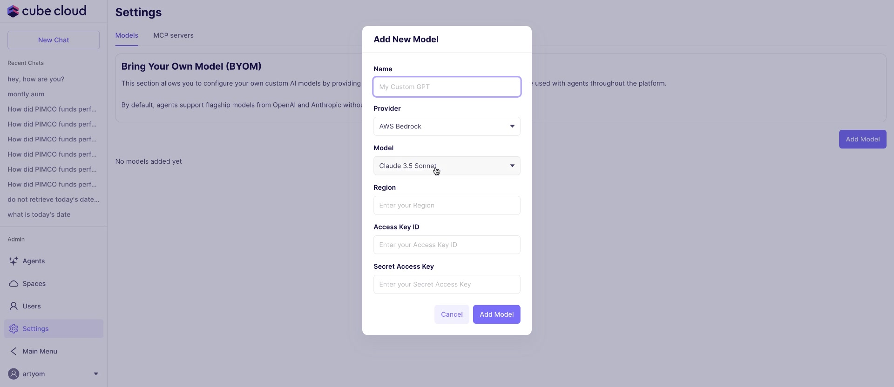

The `MCP servers` section will allow you to configure connections.

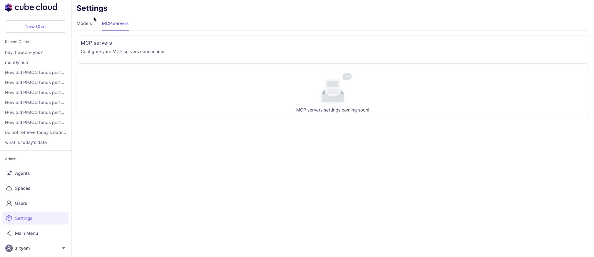

It currently displays a loading indicator and the message "MCP server settings coming soon."

## Agent Spaces

To manage agent spaces, select `Spaces` in the sidebar.

You can create new spaces, view existing spaces, and delete spaces.

To create a new space, click `Create Space` and enter a `Name` for the space.

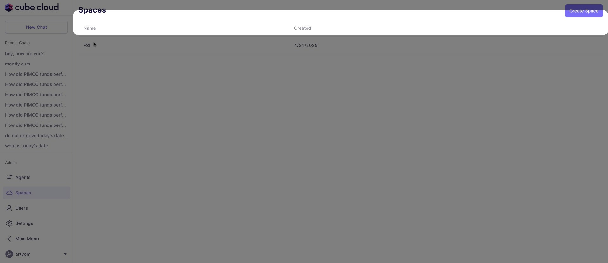

To delete a space, select the space from the list and click `Delete Space`.

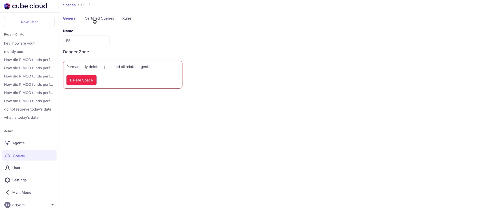

A modal will appear to confirm the deletion. Deleting a space permanently removes it and all related agents.

### Certified Queries

Within a space, click the `Certified Queries` tab to view and manage certified queries.

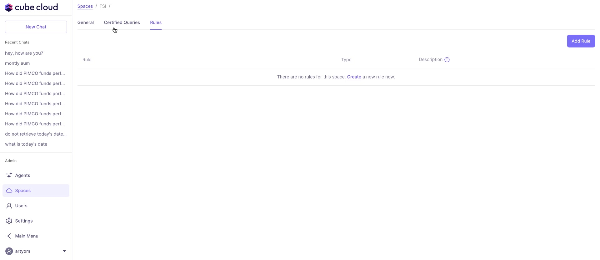

If there are no certified queries, this will be indicated.

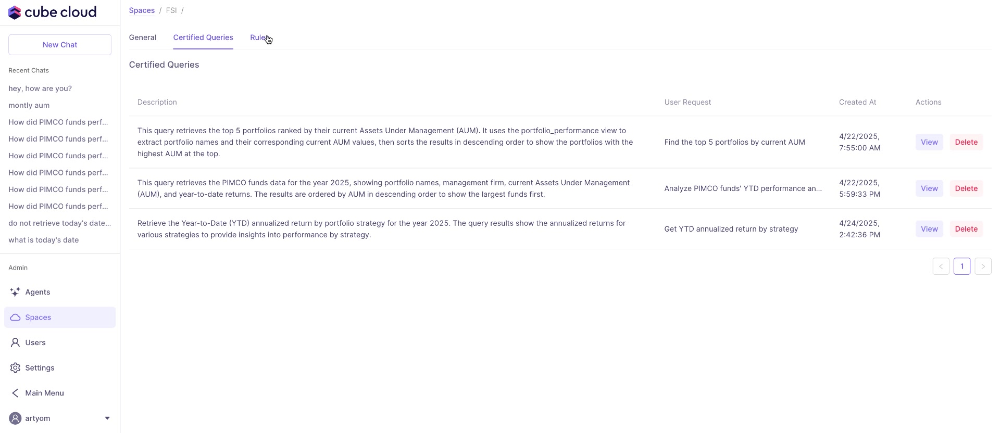

Otherwise, you will see a table of certified queries, with options to `View` and `Delete` each query.

Use the pagination controls to navigate through multiple pages if needed.

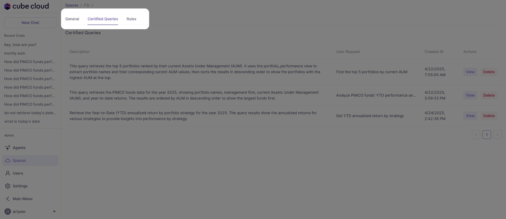

### Rules

Click the `Rules` tab to manage rules for the selected space.

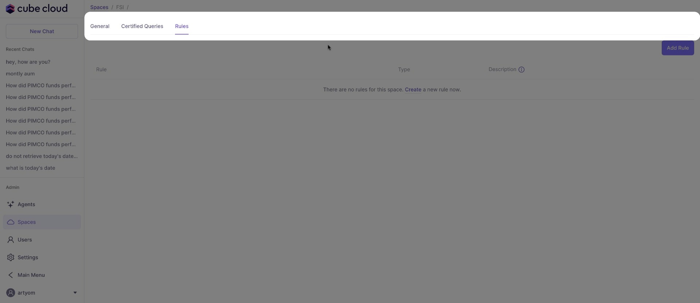

If no rules exist, you will see a message indicating this, along with an `Add Rule` button.

To add a new rule, click `Add Rule`.

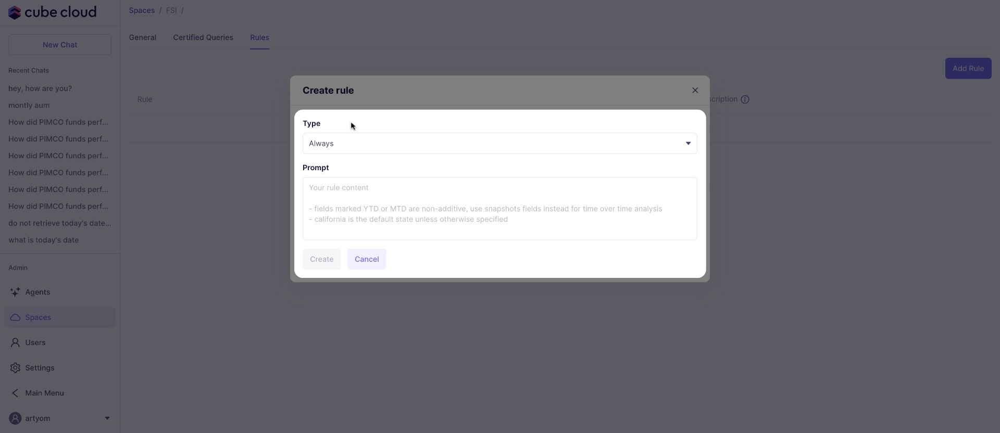

Choose the `Type` from the dropdown and enter a `Prompt` for the rule. You may also enter a `Description` for the rule.

## Agents

To manage agents, select `Agents` in the sidebar.

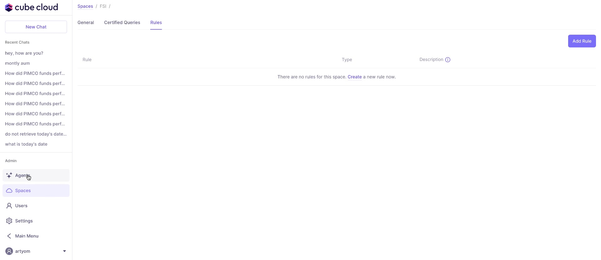

If there are no agents, a table will be displayed along with a button to `Create Agent`.

To create a new agent, click `Create Agent`.

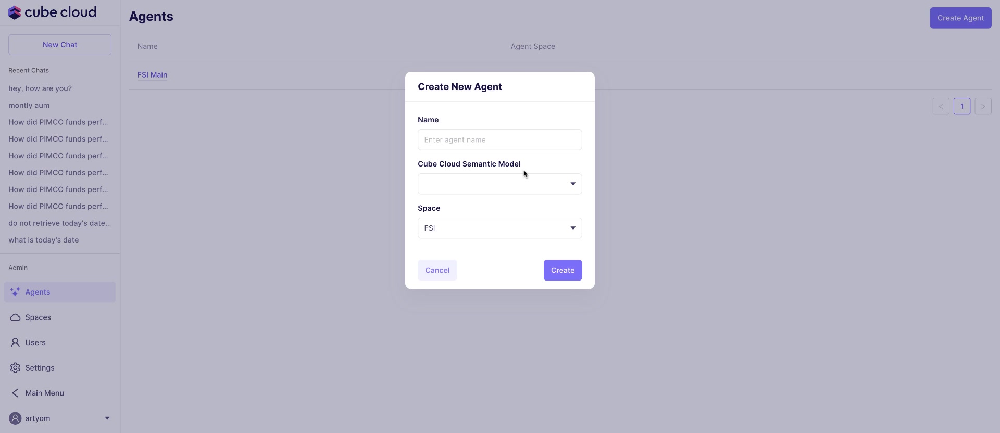

Enter a `Name` for the agent (required), select a `Cube Cloud Semantic Model`, and then select the `Space` for the agent.

To delete an agent, go to the agent details view and click `Delete Agent`.

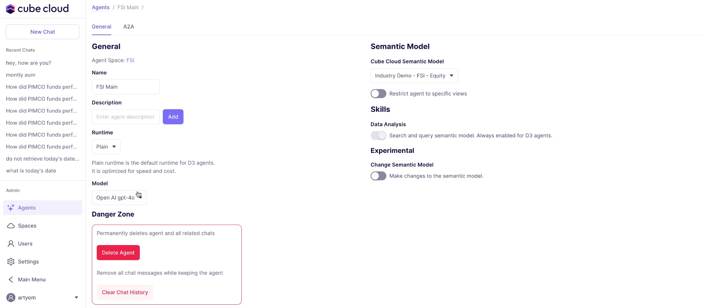

You can also `Clear Chat History` for the agent.