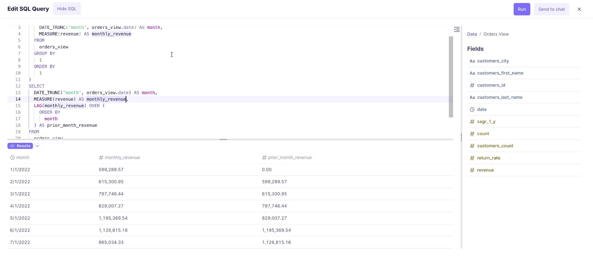
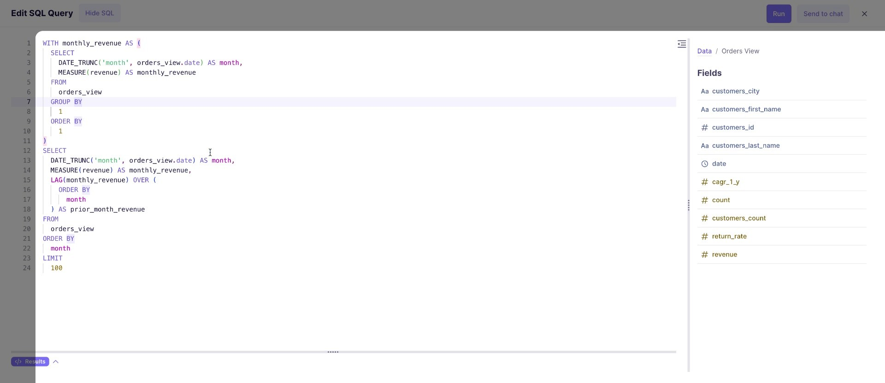
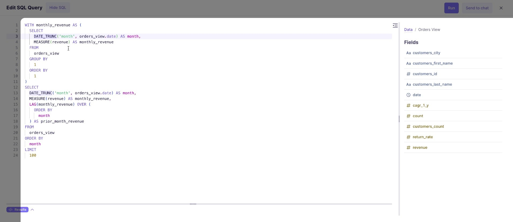
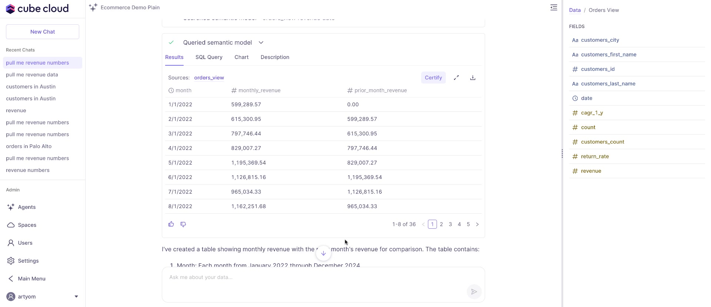
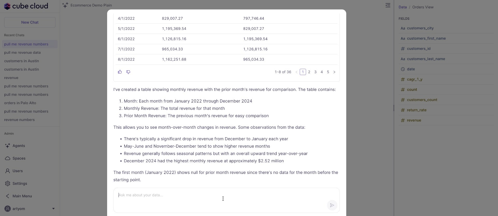
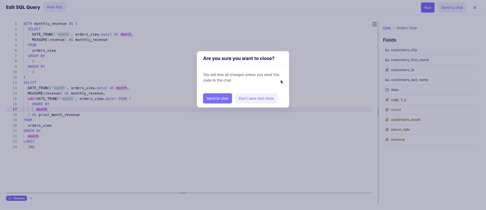
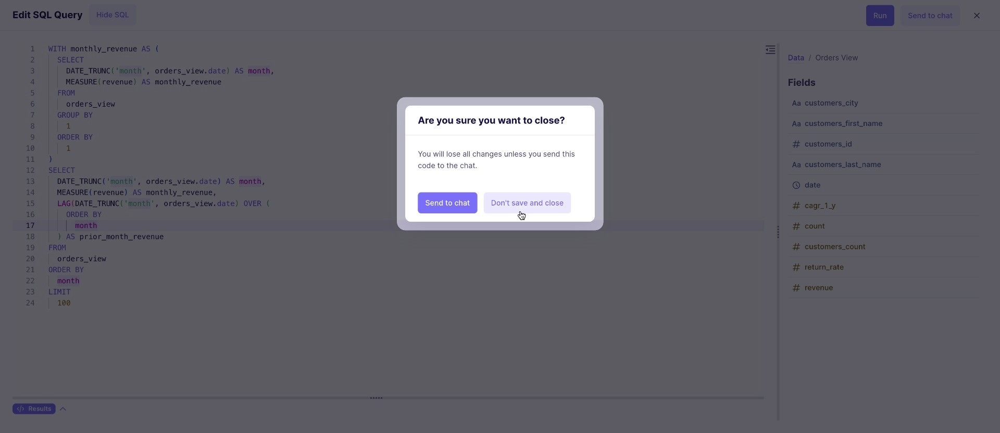

## Overview

Use the SQL editor in Cube to write, modify, and run queries, and send query results to chat.

## Using the Query Editor

Open the query editor in Cube.

You will see a text box labeled `Edit SQL Query`, where you can write and edit your queries. The `Fields` section to the right lists available fields. Click a field name to add it to the query, or type it directly into the query text box.

You may already see a pre-populated query.

If so, you can run or modify this query.

### Modifying and Running a Query

To modify the query, edit the text in the `Edit SQL Query` text box. You can add fields from the `Fields` section by clicking on the desired field. You can also type in field names directly.

For example, you could change `DATE_TRUNC('y', orders_view.date)` to `DATE_TRUNC('year', orders_view.date)`.

After making changes, click the `Run` button to see the updated results.

Click the `Send to chat` button to send the query results to chat. This avoids repetition using CTEs (Common Table Expressions), allows smaller changes to be made easily, and provides feedback to the agent. Consider attaching context to feedback (e.g., "do this instead").

### Using the Results Table

The query results display in a table below the query editor.

A summary section below the table shows summary information for the displayed data.

Use the `Pagination Controls` below the table to navigate through pages of data if there are a lot of results.

### Closing the Editor

To close the editor, click the close button.

A confirmation modal will appear asking you to confirm.

You can choose to `Send to chat` to save and send the query before closing, or click `Don't save and close` to close without saving.

