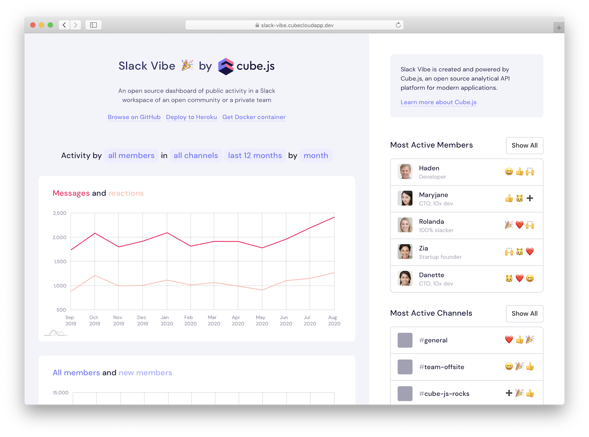
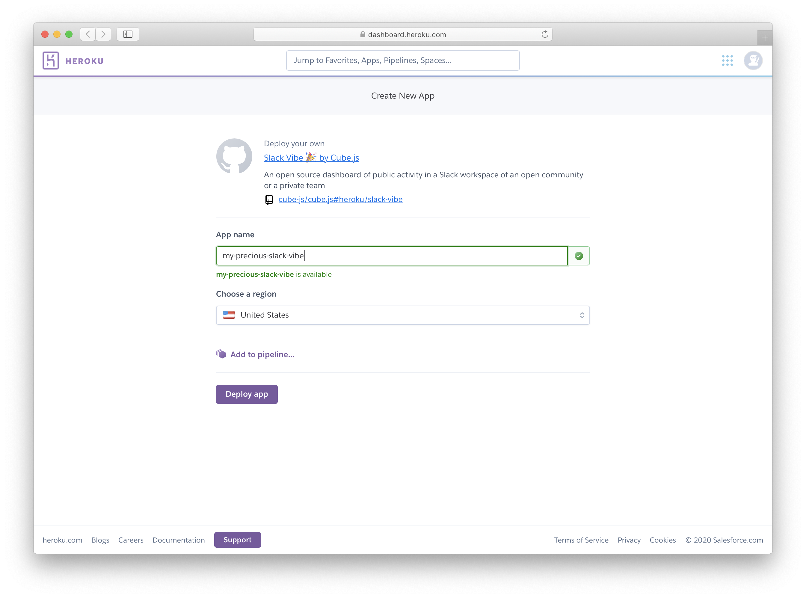

# Slack Vibe 🎉, the Open Source Analytics for Slack

[See in action](https://slack-vibe-demo.cube.dev?utm_source=product&utm_medium=github-readme&utm_campaign=slack-vibe) · [Read the blog post](https://cube.dev/blog?utm_source=product&utm_medium=github-readme&utm_campaign=slack-vibe) · [Run and deploy](#deploying-to-heroku)

## About Slack Vibe 🎉

*Slack Vibe* is an open-source dashboard of public activity in any Slack workspace of an open community or a private team.

It combines the power of Cube.js with data about public activity in any Slack workspace of an open community or a private team. *Slack Vibe* knows everything:

* Is your audience still growing?
* Which days of a week are the hottest?
* Which emoji reactions are over-used by community admins?

[See *Slack Vibe* in action](https://slack-vibe-demo.cube.dev?utm_source=product&utm_medium=github-readme&utm_campaign=slack-vibe) and [read the blog post](https://cube.dev/blog?utm_source=product&utm_medium=github-readme&utm_campaign=slack-vibe) about it.

*Slack Vibe* is an open source dashboard of public activity in a Slack workspace of an open community or a private team.

*Slack Vibe* is created and powered by [Cube.js](https://cube.dev?utm_source=product&utm_medium=github-readme&utm_campaign=slack-vibe), an open source analytical API platform for modern applications. Many developers build internal business intelligence tools or add customer‑facing analytics to applications with Cube.js.

## How to Run and Deploy 

### Deploying to Heroku

You can deploy *Slack Vibe* to Heroku.

* Sign up or log in to [Heroku](https://id.heroku.com/login).
* Open the [magic link](https://dashboard.heroku.com/new?template=https://github.com/cube-js/cube.js/tree/heroku/slack-vibe/).
* Configure your deployment: enter application name, choose a region, click *Deploy app*.

*See on YouTube: deploy to Heroku in less than a minute.*

### Running with Docker

You can run a pre-built Docker image of *Slack Vibe*.

* Run `docker run -p 4000:4000 cubejs/slack-vibe:latest` to start the application.
* Open [localhost:4000](http://localhost:4000) in your browser.

You can also use provided [Dockerfile](./Dockerfile) to build your own image.

### Running locally

You can build and run Slack Vibe on your local machine.

* Run `npm install`, then run `npm run dev` to start the back-end application.
* Run `npm install`, then run `npm run dev` in `frontend` folder to start the front-end application.
* Open [localhost:3000](http://localhost:3000) in your browser.

### Running in production

You can build and run Slack Vibe on a remote server or on a cloud platform of your preference.

* Run `npm install`, then run `npm run build` in `frontend` folder to build the front-end application.
* Run `npm install`, then run `npm start` to start the back-end application.
* Open [localhost:4000](http://localhost:4000) in your browser.

### Database

Slack Vibe stores data in the `db.sqlite` file managed by an embedded SQLite database. Remove this file to clear the data.

## Development

To deploy this example to Cube Cloud:
* build the front-end application
* run `cubejs deploy`

To rebuild the Docker image and upload it to Docker Hub:
* run `docker build -t cubejs/slack-vibe:VERSION -t cubejs/slack-vibe:latest .`
* run `docker push cubejs/slack-vibe:VERSION && docker push cubejs/slack-vibe:latest`

To update the Heroku template:
* replace all repository contents with the contents of this folder
* build the front-end application
* push-force the result into the `heroku/slack-vibe` branch
