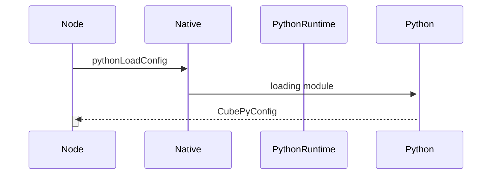
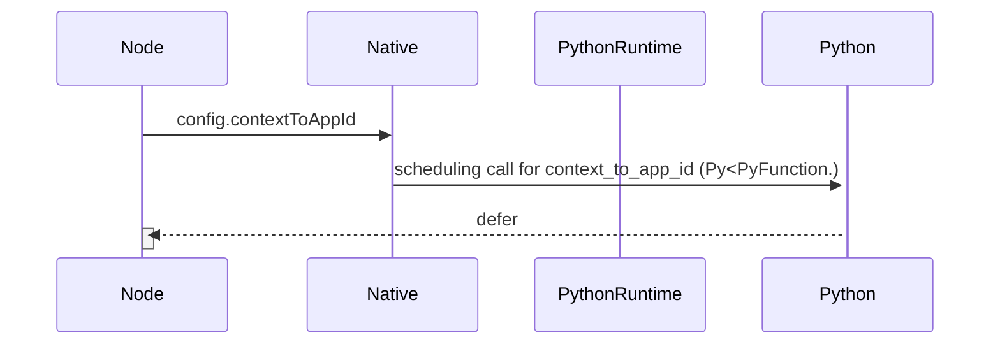

### Python load `cube.py`:


```mermaid
sequenceDiagram
    participant Node
    participant Native
    participant PythonRuntime
    participant Python

    Node->>Native: pythonLoadConfig
    activate Node
    Native->>+Python: loading module
    Python-->>+Node: CubePyConfig
    deactivate Node
```

# Calling python

```py
def context_to_app_id(ctx):
    print('content_to_app_id', ctx)

    return 'CUBEJS_APP_{}'.format(ctx.securityContext.userId)
```


```mermaid
sequenceDiagram
    participant Node
    participant Native
    participant PythonRuntime
    participant Python

    Node->>Native: config.contextToAppId
    activate Node
    Native->>+Python: scheduling call for context_to_app_id (Py<PyFunction.)
    Python-->>+Node: defer
    deactivate Node
```
