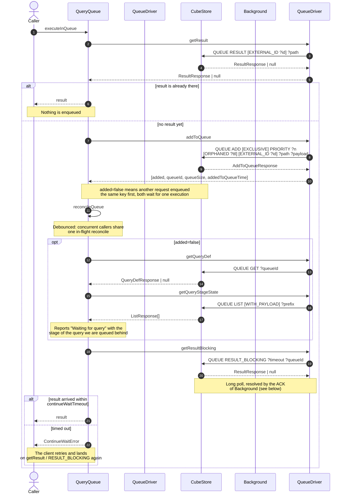
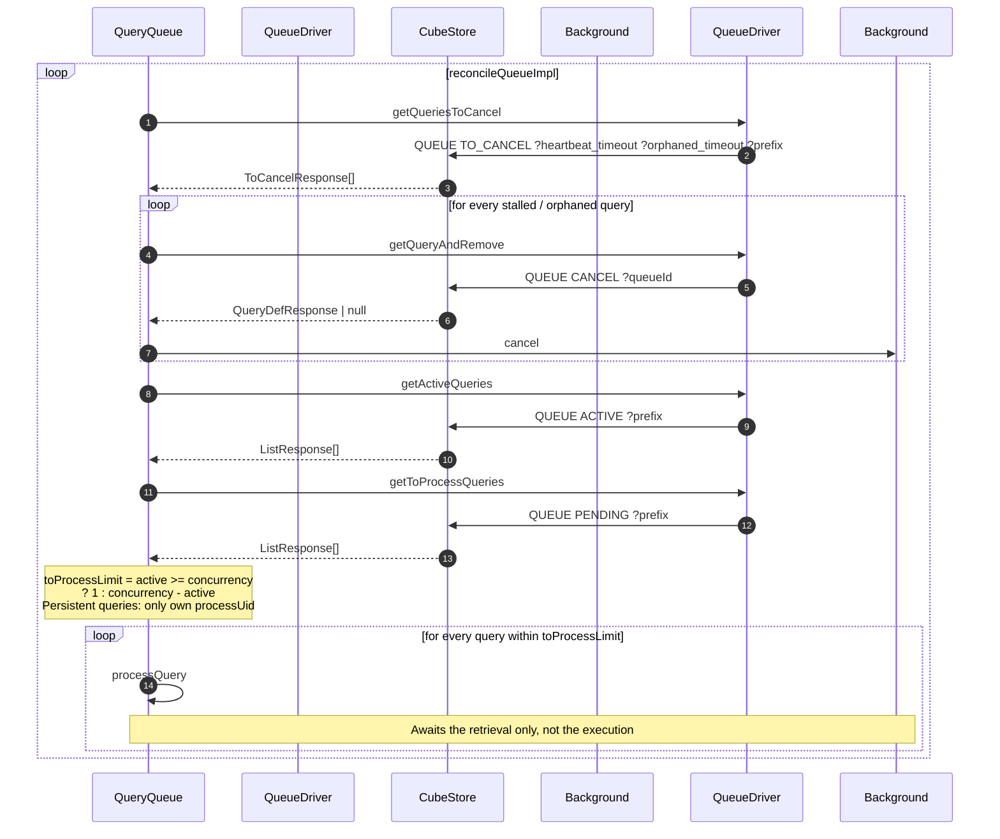
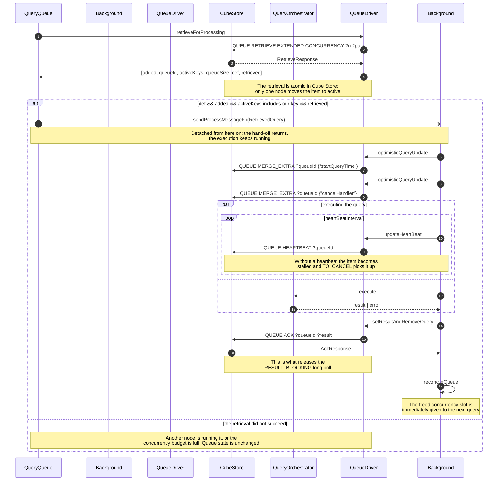
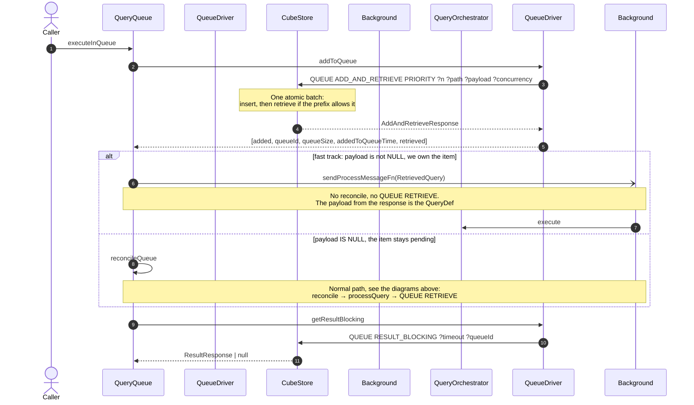

# Queue design

`QueryQueue` never holds the queue state itself, every transition goes through
`QueueDriverInterface`. These diagrams describe the Cube Store driver, where each
transition is a `QUEUE *` SQL command; Cube Store serializes all queue writes, so the queue
stays correct across many Cube API instances. `LocalQueueDriver` implements the same
interface in memory for a single process (development, unit tests).

Two participants matter when reading the diagrams:

- **QueryQueue** — the request side. It enqueues and then waits for a result.
- **BackgroundQueryQueue** — the same `QueryQueue` object, but the code paths reached
  through `executeQuery`, which run detached from the request (in cluster mode they can
  even run on another node).

Retrieving and executing are two separate steps: `processQuery` retrieves an item and then hands
the retrieval to `sendProcessMessageFn`, which executes it through `executeQuery`. See
"Background execution" below.

## Cube Store responses as TS types

```typescript
type integer = number;
type QueueId = number;

// QUEUE ADD
type AddToQueueResponse = {
    id: QueueId,
    added: boolean,   // false when the path was already in the queue
    pending: integer, // after the operation, scoped to the prefix
}
// QUEUE ADD_AND_RETRIEVE, extends AddToQueueResponse (see "Fast track" below)
type AddAndRetrieveResponse = AddToQueueResponse & {
    active: string | null,  // comma separated keys, NULL when empty
    payload: string | null, // NULL means "the item was not retrieved"
    extra: string | null,
}
// QUEUE RETRIEVE [EXTENDED] CONCURRENCY
type RetrieveResponse = {
    payload: string,
    extra: string | null,
    pending: integer,
    active: string | null,
    id: QueueId
}
// QUEUE LIST / PENDING / ACTIVE
type ListResponse = {
    id: string, // the path, not the QueueId — kept for backward compatibility
    queue_id: QueueId,
    status: 'pending' | 'active',
    extra: string | null,
    payload?: string, // only with WITH_PAYLOAD
}
// QUEUE TO_CANCEL / STALLED / ORPHANED
type ToCancelResponse = {
    id: string,
    queue_id: QueueId,
}
// QUEUE GET / CANCEL
type QueryDefResponse = {
    payload: string,
    extra: string | null,
}
// QUEUE ACK
type AckResponse = {
    success: boolean
}
// QUEUE RESULT / RESULT_BLOCKING
type ResultResponse = {
    payload: string,
    'type': ResultStatus,
    id: QueueId,
    external_id: string | null,
}
enum ResultStatus {
    Success = 'success'
}
```

`EXTENDED` on `QUEUE RETRIEVE` changes only the failure shape: without it a failed retrieval
returns zero rows, with it a single row where `payload` and `id` are `NULL` but `pending`
and `active` are filled. The driver always sends `EXTENDED`.

## Enqueue and wait: `executeInQueue`


```mermaid
sequenceDiagram
    autonumber
    actor Caller
    participant QueryQueue
    participant QueueDriverInterface as QueueDriver
    participant CubeStore
    participant BackgroundQueryQueue as Background

    Caller->>QueryQueue: executeInQueue

    QueryQueue->>QueueDriver: getResult
    QueueDriver->>CubeStore: QUEUE RESULT [EXTERNAL_ID ?id] ?path
    CubeStore-->>QueueDriver: ResultResponse | null
    QueueDriver-->>QueryQueue: ResultResponse | null

    alt result is already there
        QueryQueue-->>Caller: result
        Note over QueryQueue,Caller: Nothing is enqueued
    else no result yet
        QueryQueue->>QueueDriver: addToQueue
        QueueDriver->>CubeStore: QUEUE ADD [EXCLUSIVE] PRIORITY ?n<br/>[ORPHANED ?ttl] [EXTERNAL_ID ?id] ?path ?payload
        CubeStore-->>QueueDriver: AddToQueueResponse
        QueueDriver-->>QueryQueue: [added, queueId, queueSize, addedToQueueTime]
        Note over QueryQueue,CubeStore: added=false means another request enqueued<br/>the same key first, both wait for one execution

        QueryQueue->>QueryQueue: reconcileQueue
        Note over QueryQueue: Debounced: concurrent callers share<br/>one in-flight reconcile

        opt added=false
            QueryQueue->>QueueDriver: getQueryDef
            QueueDriver->>CubeStore: QUEUE GET ?queueId
            CubeStore-->>QueryQueue: QueryDefResponse | null

            QueryQueue->>QueueDriver: getQueryStageState
            QueueDriver->>CubeStore: QUEUE LIST [WITH_PAYLOAD] ?prefix
            CubeStore-->>QueryQueue: ListResponse[]
            Note over QueryQueue: Reports "Waiting for query" with the<br/>stage of the query we are queued behind
        end

        QueryQueue->>QueueDriver: getResultBlocking
        QueueDriver->>CubeStore: QUEUE RESULT_BLOCKING ?timeout ?queueId
        CubeStore-->>QueueDriver: ResultResponse | null
        Note over QueueDriver,CubeStore: Long poll, resolved by the ACK<br/>of Background (see below)

        alt result arrived within continueWaitTimeout
            QueryQueue-->>Caller: result
        else timed out
            QueryQueue-->>Caller: ContinueWaitError
            Note over Caller,QueryQueue: The client retries and lands<br/>on getResult / RESULT_BLOCKING again
        end
    end
```

## Reconcile: deciding what to start

`reconcileQueue` is the only place that starts work, and it is what enforces concurrency on
the client side. Note that concurrency is per queue, not per node.


```mermaid
sequenceDiagram
    autonumber
    participant QueryQueue
    participant QueueDriverInterface as QueueDriver
    participant CubeStore
    participant BackgroundQueryQueue as Background

    loop reconcileQueueImpl
        QueryQueue->>QueueDriver: getQueriesToCancel
        QueueDriver->>CubeStore: QUEUE TO_CANCEL ?heartbeat_timeout ?orphaned_timeout ?prefix
        CubeStore-->>QueryQueue: ToCancelResponse[]

        loop for every stalled / orphaned query
            QueryQueue->>QueueDriver: getQueryAndRemove
            QueueDriver->>CubeStore: QUEUE CANCEL ?queueId
            CubeStore-->>QueryQueue: QueryDefResponse | null
            QueryQueue->>Background: cancel
        end

        QueryQueue->>QueueDriver: getActiveQueries
        QueueDriver->>CubeStore: QUEUE ACTIVE ?prefix
        CubeStore-->>QueryQueue: ListResponse[]

        QueryQueue->>QueueDriver: getToProcessQueries
        QueueDriver->>CubeStore: QUEUE PENDING ?prefix
        CubeStore-->>QueryQueue: ListResponse[]

        Note over QueryQueue: toProcessLimit = active >= concurrency<br/>? 1 : concurrency - active<br/>Persistent queries: only own processUid

        loop for every query within toProcessLimit
            QueryQueue->>QueryQueue: processQuery
            Note over QueryQueue,Background: Awaits the retrieval only, not the execution
        end
    end
```

## Background execution: `processQuery` → `executeQuery`

`processQuery` retrieves the item and nothing else. What it hands to `sendProcessMessageFn` is a
`RetrievedQuery` — `{ queryKeyHash, queueId, queueSize, query }`, plain data on
purpose, so a custom implementation can serialize it and let another process run
`executeQuery`. The default implementation calls `executeQuery` in-process.

`queueId` identifies the specific generation of a queue item. The memory driver compares it
with the active entry before updating or acknowledging a query, while Cube Store keys those
commands directly off the `queueId`.

`sendProcessMessageFn` must resolve once the hand-off is done, **not** once the query is
executed: reconcile awaits it, and `executeQuery` ends with `reconcileQueue`, which is
single-flight — awaiting the execution from inside reconcile deadlocks.

Two consequences of retrieving before the hand-off:

- Stream queries have to be executed by the process that retrieved them, their streams live in
  the in-process `QueryQueue.streams` map. Reconcile only picks up persistent keys whose
  `@<processUid>` suffix matches, so `sendProcessMessageFn` is always called on the owning
  process for them — it just must not route them elsewhere.
- A retrieved item is already active. If a custom hand-off loses the message, the item is only
  recovered by the stalled-heartbeat / `TO_CANCEL` path; a successful retrieval is not undone
  when the hand-off fails.

A stream query is dispatched while `executeInQueue` is still running, so `waitForQueryStream`
subscribes to `streamStarted` *before* the dispatch — a handler which starts fast would
otherwise emit into no listener. Two things have to fail before that costs a request: the
event, and the `streams` map lookup `waitForQueryStream` does before it arms its timeout.
That fallback is why reverting the subscribe order does not break the streaming tests, and
why the ordering has a test of its own asserting the call sequence.


```mermaid
sequenceDiagram
    autonumber
    participant QueryQueue
    participant BackgroundQueryQueue as Background
    participant QueueDriverInterface as QueueDriver
    participant CubeStore
    participant QueryOrchestrator

    QueryQueue->>QueueDriver: retrieveForProcessing
    QueueDriver->>CubeStore: QUEUE RETRIEVE EXTENDED CONCURRENCY ?n ?path
    CubeStore-->>QueueDriver: RetrieveResponse
    QueueDriver-->>QueryQueue: [added, queueId, activeKeys, queueSize, def, retrieved]
    Note over QueueDriver,CubeStore: The retrieval is atomic in Cube Store:<br/>only one node moves the item to active

    alt def && added && activeKeys includes our key && retrieved
        QueryQueue-)Background: sendProcessMessageFn(RetrievedQuery)
        Note over QueryQueue,Background: Detached from here on: the hand-off returns,<br/>the execution keeps running

        Background->>QueueDriver: optimisticQueryUpdate
        QueueDriver->>CubeStore: QUEUE MERGE_EXTRA ?queueId {"startQueryTime"}

        Background->>QueueDriver: optimisticQueryUpdate
        QueueDriver->>CubeStore: QUEUE MERGE_EXTRA ?queueId {"cancelHandler"}

        par executing the query
            loop heartBeatInterval
                Background->>QueueDriver: updateHeartBeat
                QueueDriver->>CubeStore: QUEUE HEARTBEAT ?queueId
                Note over Background,CubeStore: Without a heartbeat the item becomes<br/>stalled and TO_CANCEL picks it up
            end
        and
            Background->>QueryOrchestrator: execute
            QueryOrchestrator-->>Background: result | error
        end

        Background->>QueueDriver: setResultAndRemoveQuery
        QueueDriver->>CubeStore: QUEUE ACK ?queueId ?result
        CubeStore-->>Background: AckResponse
        Note over QueueDriver,CubeStore: This is what releases the<br/>RESULT_BLOCKING long poll

        Background->>Background: reconcileQueue
        Note over Background: The freed concurrency slot is<br/>immediately given to the next query
    else the retrieval did not succeed
        Note over QueryQueue,QueueDriver: Another node is running it, or the<br/>concurrency budget is full. Queue state is unchanged
    end
```

## Fast track: `QUEUE ADD_AND_RETRIEVE`

Enqueueing a query and starting it costs two round-trips: `QUEUE ADD` marks the item
pending, then `QUEUE RETRIEVE` (reached through reconcile → `processQuery`) moves it to
active and returns the payload. Between those two calls another node can take the
concurrency slot, so the enqueueing node often pays for the second round-trip and gets
nothing back.

`QUEUE ADD_AND_RETRIEVE` inserts **and** retrieves the item in one atomic operation, so the
enqueueing request can go straight to executing:

```
QUEUE ADD_AND_RETRIEVE [EXCLUSIVE] [PRIORITY ?n] [ORPHANED ?ttl] [EXTERNAL_ID ?id]
    ?path ?payload ?concurrency
```

The item is retrieved when the prefix has a concurrency slot for it *and* for everything
already queued — `active + pending < concurrency`, where `concurrency` is the same budget
`QUEUE RETRIEVE CONCURRENCY` uses and `pending` does not count the item itself.

The driver only emits the command for queries at **priority 10 or above**. That is where
the latency-sensitive work sits — `QueryCache` submits a user query at 10, and
`PreAggregationLoader` uses 10 for a build a request is waiting on — while background
refresh comes in below it. A background sweep runs the queue at its concurrency ceiling for
minutes, which is the one regime where the retrieval never succeeds and the extra `concurrency`
parameter is pure overhead.

`payload IS NULL` in the response means the item was not retrieved — the condition failed,
the item was already active, or it belongs to another process — and the caller falls back
to the normal path with nothing lost, because the item is enqueued either way.


```mermaid
sequenceDiagram
    autonumber
    actor Caller
    participant QueryQueue
    participant QueueDriverInterface as QueueDriver
    participant CubeStore
    participant BackgroundQueryQueue as Background
    participant QueryOrchestrator

    Caller->>QueryQueue: executeInQueue
    QueryQueue->>QueueDriver: addToQueue

    QueueDriver->>CubeStore: QUEUE ADD_AND_RETRIEVE PRIORITY ?n ?path ?payload ?concurrency
    Note over CubeStore: One atomic batch:<br/>insert, then retrieve if the prefix allows it
    CubeStore-->>QueueDriver: AddAndRetrieveResponse
    QueueDriver-->>QueryQueue: [added, queueId, queueSize, addedToQueueTime, retrieved]

    alt fast track: payload is not NULL, we own the item
        QueryQueue-)Background: sendProcessMessageFn(RetrievedQuery)
        Note over QueryQueue,Background: No reconcile, no QUEUE RETRIEVE.<br/>The payload from the response is the QueryDef
        Background->>QueryOrchestrator: execute
    else payload IS NULL, the item stays pending
        QueryQueue->>QueryQueue: reconcileQueue
        Note over QueryQueue,Background: Normal path, see the diagrams above:<br/>reconcile → processQuery → QUEUE RETRIEVE
    end

    QueryQueue->>QueueDriver: getResultBlocking
    QueueDriver->>CubeStore: QUEUE RESULT_BLOCKING ?timeout ?queueId
    CubeStore-->>QueryQueue: ResultResponse | null
```

What the fast track saves per query, when the slot is free:

| Step | Normal | Fast track |
|---|---|---|
| `QUEUE ADD` | 1 round-trip | folded into one command |
| `QUEUE TO_CANCEL` + `QUEUE LIST` (reconcile) | 2 round-trips | skipped |
| `QUEUE RETRIEVE` | 1 round-trip | folded into one command |
| `QUEUE LIST` (the `Waiting for query` event) | 1 round-trip | skipped, the retrieval carries the state |
| Window for another node to steal the slot | between ADD and RETRIEVE | none |

Everything after the retrieval is unchanged: `MERGE_EXTRA`, `HEARTBEAT`, `ACK` and
`RESULT_BLOCKING` behave exactly as in the normal path, and a fast-tracked item is a
regular active item — `TO_CANCEL` will reclaim it if the heartbeat stops.

Two side effects are worth knowing about:

- `QUEUE ADD` reports the queue depth *including* the item it just made pending, while a
  retrieved item never becomes pending, so the `queueSize` of the `Added to queue` and
  `Waiting for query` log events drops by one on the fast track. The events carry
  `fastTrack` so the two can be told apart.
- `reconcileQueue` is the only caller of `QUEUE TO_CANCEL`, and the fast track skips it, so
  orphaned and stalled items are no longer collected at submission time. They still are
  after every completed query (`executeQuery` reconciles once it acknowledges the result),
  and a submission only skips reconcile while the concurrency budget is free — which is
  exactly when there is no budget to reclaim.

Priority ordering is enforced by the *selection* step, not by the retrieval: `QUEUE PENDING`
returns items highest priority first (oldest first within a priority) and reconcile takes
`toProcessLimit` off the top of that list. `QUEUE RETRIEVE <path>` itself is priority blind
— it is safe only because the path it is given came from that sorted list.

The fast track selects itself, so it is priority blind with nothing to compensate. That is
what the `active + pending < concurrency` condition rules out: retrieving leaves a free slot
for every item already pending, so no item is jumped over, and once the budget gets tight
the fast track steps aside and lets reconcile pick by priority. A retrieved item goes straight
to active and never becomes pending, so a burst onto an idle queue fast-tracks exactly one
concurrency budget's worth and no more: items start accumulating in pending the moment the
budget is exhausted, which is when the condition stops firing. S3 measures this exactly —
50 retrievals out of 1000 at concurrency 50, 200 out of 1000 at concurrency 200 — so on a
burst the saving scales as `concurrency / burst size`, not with the size of the burst.

## Benchmarks

The harness lives in `test/benchmarks/` and is compiled by the ordinary `yarn tsc` — jest never
picks it up (`testMatch` is `*.test.ts`). Runs go through the suite runner:

```bash
yarn tsc
yarn bench:suite --list                  # what the suites are
yarn bench:suite S1 --dry-run            # the matrix with computed ρ and wall clock, run this first
yarn bench:suite S1                      # off and on, one pass each
yarn bench:suite --report .context/bench-results/S1-….jsonl
```

Every run emits one `BENCH_RESULT {json}` line plus a `BENCH_TICK {json}` per second; the runner
collects both into `.context/bench-results/<suites>-<stamp>.jsonl` and prints a markdown summary.
A single run can also be driven straight from env vars against
`dist/test/benchmarks/QueueCubestore.bench.js` (or `QueueMemory.bench.js`) — see `readSettings`
in `QueueBench.abstract.ts` for the full list.

The one axis that decides everything is the load factor:

```
ρ = arrival_rate / capacity,   capacity = concurrency / handler_latency
```

The fast track saves a round trip only while the concurrency budget has a free slot, so ρ is
what the suites sweep. `driverCalls.fastTrack.missRate` is the direct measure of the cost side:
an `ADD_AND_RETRIEVE` that comes back without a retrieval is a round trip spent for nothing.
Eligibility is read off the connection's `useFastTrack`, so a driver that cannot fast track
never registers an attempt.

Two things about the numbers are artifacts of the harness rather than production behaviour:

- Workers poll `reconcileQueue` on a timer (`BENCH_WORKER_RECONCILE_MS`, default 50ms) because a
  worker never submits and so has no submit-time reconcile to bootstrap from. Production
  reconcile is event-driven. This poll dominates `getQueriesToCancel` / `getActiveAndToProcess`
  and is the entire traffic of the idle-floor suite, which is why S5 measures two intervals.
- Payload defaults are 5MB responses / 256KB query bodies, but the suites deliberately run at
  64KB / 16KB. S7 owns the payload axis.
