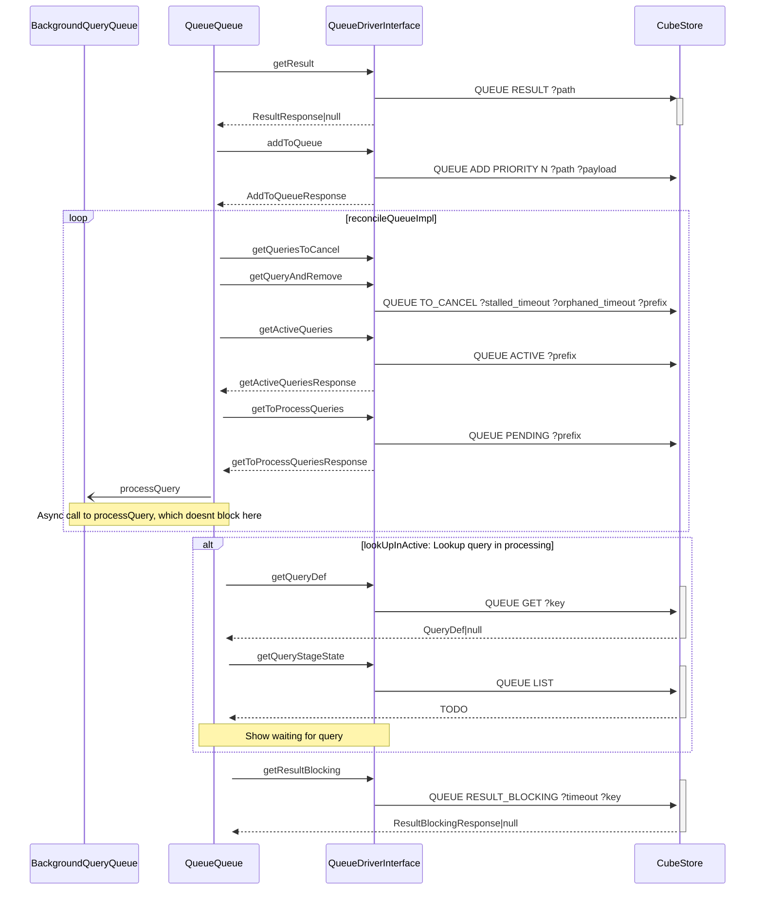

### Queue design v1:

Responses as TS types

```typescript
type integer = number;
type QueueId = number;

type AddToQueueResponse = {
    id: QueueId,
    added: boolean,
    pending: string,
}
type RetrieveResponse = {
    payload: string,
    extra:   string,
    pending: integer,
    active: string,
    id: QueueId
}
type AckResponse = {
    success: boolean
}
type ResultResponse = {
    payload: string
    'type': ResultStatus
}
type ResultBlockingResponse = {
    payload: string
    'type': ResultStatus
}
enum ResultStatus {
    Success = 'success'
}
```



### Background execution process:


