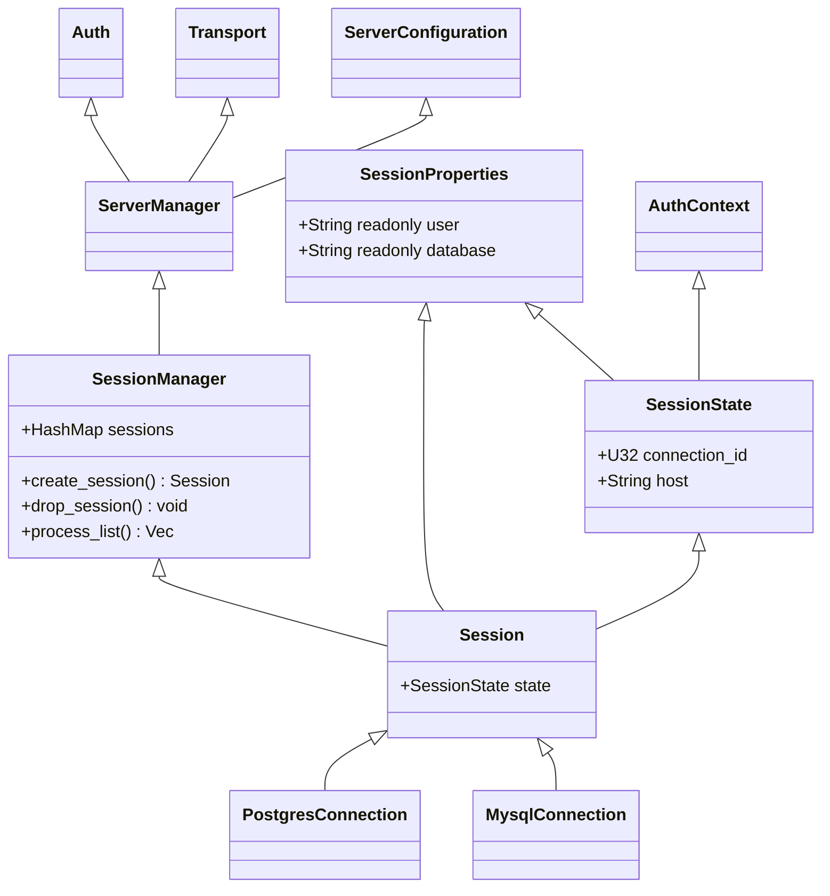
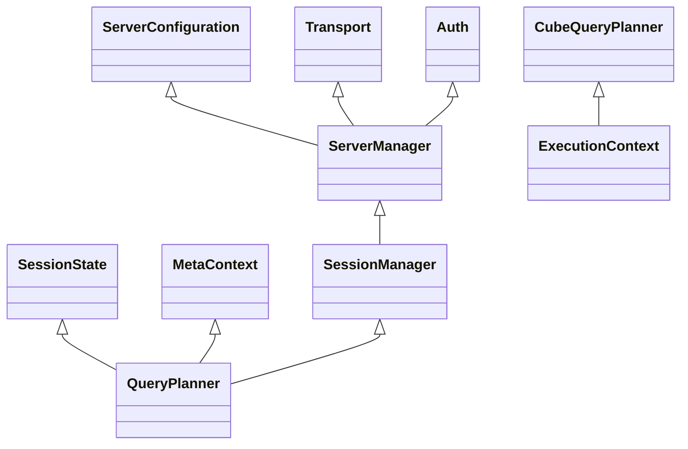

# Development

## Build and run

### Prerequisites:

- `rustup`
- `cargo install cargo-insta`

```bash
cd rust/cubesql
CUBESQL_CUBE_URL=$URL/cubejs-api \
CUBESQL_CUBE_TOKEN=$TOKEN \
CUBESQL_LOG_LEVEL=debug \
CUBESQL_BIND_ADDR=0.0.0.0:4444 \
cargo run
```

In a separate terminal, run:

```bash
mysql -u root -h 127.0.0.1 --ssl-mode=disabled -u root --password=test --port 4444
```

# Architecture

## Connections management



## Query Execution

